# 1.1 Un-Boxing Your BoXZY

Please read the following manual and wiki before you un-box your BoXZY:
 * [Preparing to use BoXZY](Preparing_to_use_BoXZY.md)
 * [0.1 BoXZY Safe Use](01_Boxzy_safe_use.md)

**By continuing, we assume that you have read and understood the above material. Do not continue if you have not completely read and understood each manual and wiki listed above. Please check this area in every manual before completing its steps to make sure that you have all the information necessary to make your BoXZY experience simple and safe. If you ever miss a manual or need to review a specific step, don't fret! Every manual has a list of what you should know before beginning it.**

## Step 1 — Un-Boxing BoXZY!

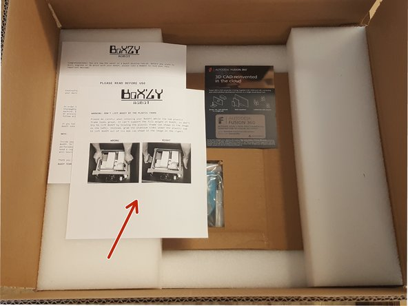
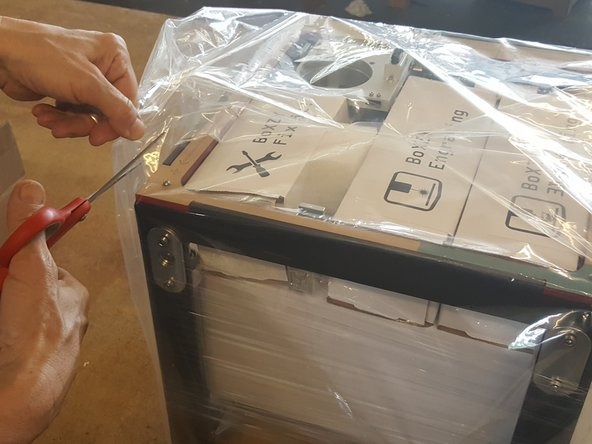

 * Your BoXZY will arrive in a cardboard box with foam inserts on the top and bottom that hold the device in place.
   * When you open the box, you'll see a few sheets of paper. Look for instructions on how to lift BoXZY without damaging the exterior. After you read these instructions, remove the top foam insert (shown in the first image for this step).
   * Carefully lift your BoXZY out of the box. Be careful! BoXZY is heavy, so you will want to set it on a sturdy surface.
 * Remove the clear plastic bag from around your BoXZY (shown in the second image for this step). You might have to cut the bag to remove it.
 *  Your BoXZY will also be wrapped in plastic shrink wrap with the wiring harness cables tucked inside. This is indicated by the green arrow in the third image for this step.
   * Carefully cut and remove the shrink wrap from your BoXZY.

## Step 2 — Un-Boxing BoXZY!

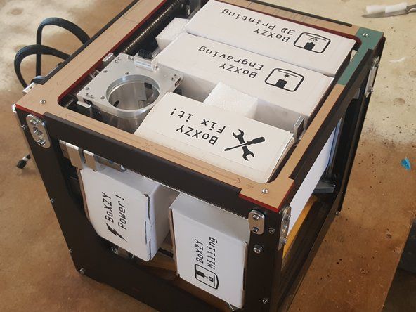
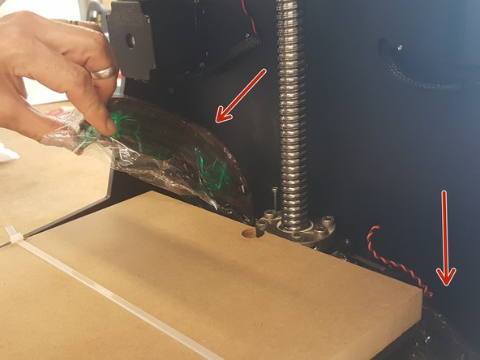
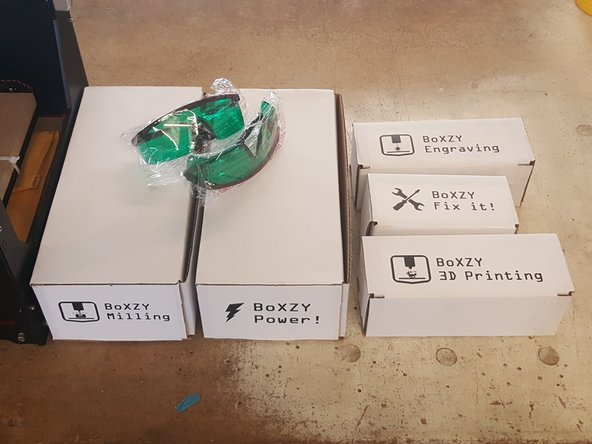

 * Remove the boxes from within your BoXZY
 * Don't forget to remove your Laser Safety Glasses, as seen in the second image for this step.

## Step 3 — Un-Boxing BoXZY!

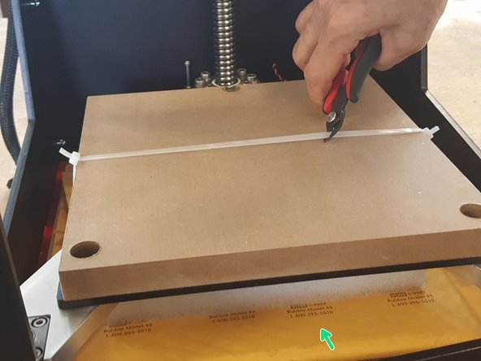
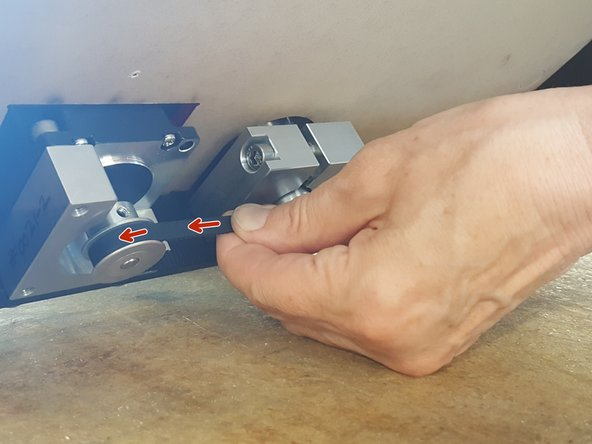

 * Cut the zip tie holding your Sacrificial Board to the Milling Platform mounted to the Z axis, as seen in the first image for this step.
 *  You will find your Leveling Platform for 3D printing and laser etching in an envelope underneath the Milling Platform. You can remove it using the instructions below:
   * Tilt your BoXZY away from you so you can access the Z axis belt on the device's underside. Be careful you do not drop your BoXZY backwards!
   *  Hold the belt at a point closest to you and and pull it from right to left, or counter-clockwise (as indicated by red arrows in the second image for this step). This will move the Z axis upwards.
   *  Remove the envelope from your BoXZY when the Z axis is high enough.

## Step 4 — Hooking Up the BoXZY Power Station and USB Cable to BoXZY

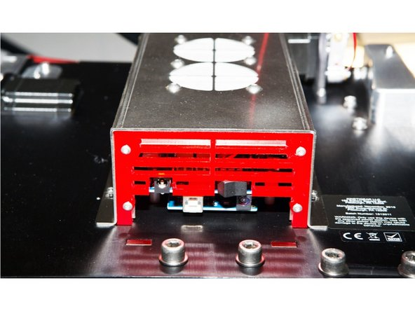
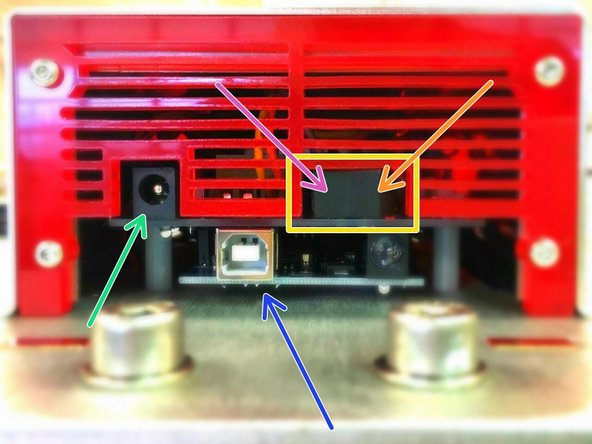
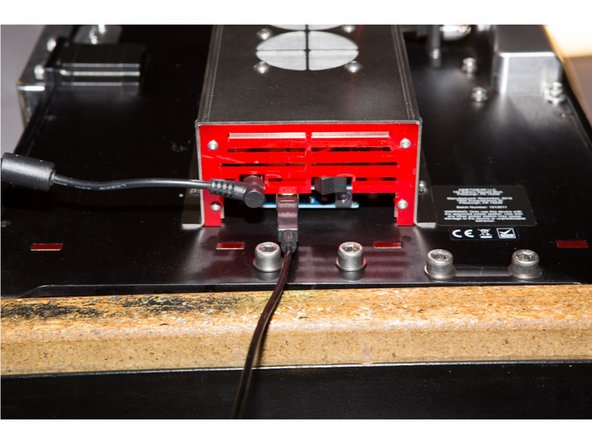

 * Temporarily turn BoXZY so you can easily see and access the bottom of the electronics enclosure, which is the stainless steel case on the back of BoXZY (as shown in the first image for this step).
 *  The green arrow in the second image for this step points to where where you connect the BoXZY Power Station to BoXZY.
 *  The blue arrow in the same image points to where you connect the USB from your computer into BoXZY.
 *  The yellow box in the image indicates the ON/OFF switch for BoXZY's microcontroller.
   *  The orange arrow points to the side of the power switch that you press to turn BoXZY's power OFF. If you're staring up at the electronics enclosure, this is the right side of the switch.
   *  The pink arrow points to the side of the power switch that you press to turn BoXZY's power ON.
     * This switch should remain in the ON position at all times. Control powering BoXZY ON or OFF with the Power Station controls.

## Step 5 — Set Up BoXZY in Your Work Area

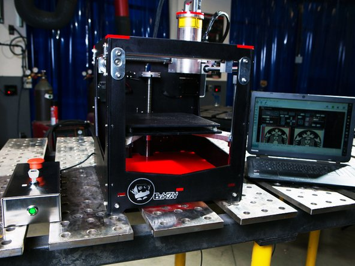
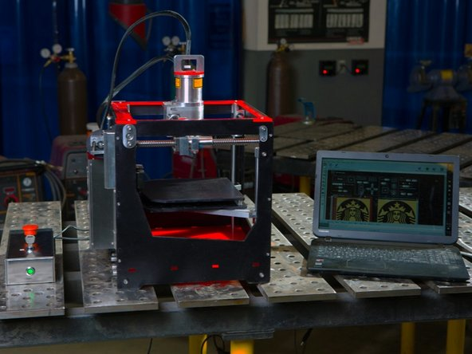
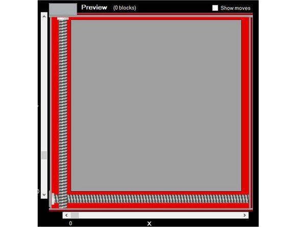

 * When arranging your work area, you should always keep your Power Station easily accessible.
 * BoXZY's underside has pulleys that run very close to the table. If they rub against surfaces, they can stop the Z axis from moving properly. To avoid this, do not set BoXZY on a soft or uneven surface.
   * We recommend 3D printing feet or using individual rubber pads if you would like to reduce noise and vibration, or if you'd like to use BoXZY on a bumpy surface.
 * Many users find that it easiest to use BoXZY when facing its front (shown in the first image for this step) OR when facing its left side (shown in the second image).
   * BoXZY Team prefers to use BoXZY facing its left side. This is because the side has a wider opening and direct access to the filament drive. The laser preview shows BoXZY from this perspective for that reason.

## Step 6 — Plug the Limit Switch Cable into BoXZY's Attachment Mount

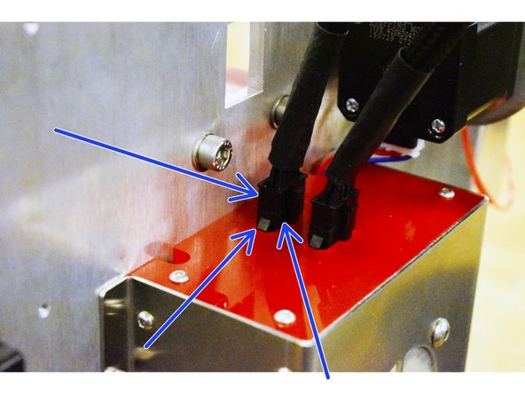
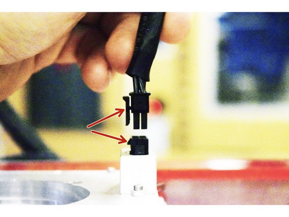
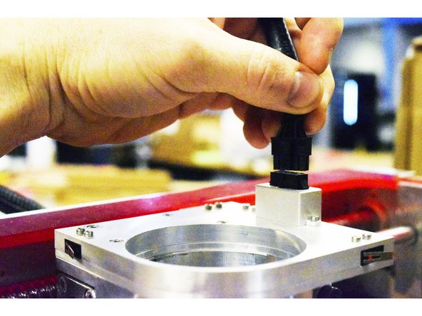

 *  On BoXZY's back electronics enclosure, find the cable labeled "limit switch" and plug it into the Attachment Mount. This is the cable closest to BoXZY's body, as indicated by blue arrows in the first image.
 * Before plugging the cables in, be sure that all prongs are clear of debris and squarely aligned. Don’t put cables where they can be bumped into or can catch on something, as they can damage the machine.
 *  Make sure that the latching clip at the end of the cable lines up with the latching clip on the Attachment Mount plug, as shown in the second image. You want to be sure that the harness plug is inserted squarely into the Attachment Mount. The third image shows you how the cord will look once plugged into the Attachment Mount.
   * This cord is only meant to be removed for service once installed. You should not regularly remove this cord.

## Step 7 — Now You're Ready to Set Up BoXZY for Use

 * Go to the following link for instructions on how to set up BoXZY for first use:
 * [1.2 Setting Up Your BoXZY](12_setting_up_your_Boxzy.md)
