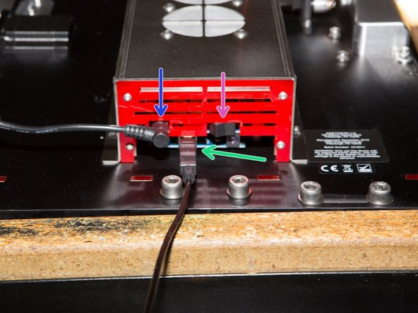
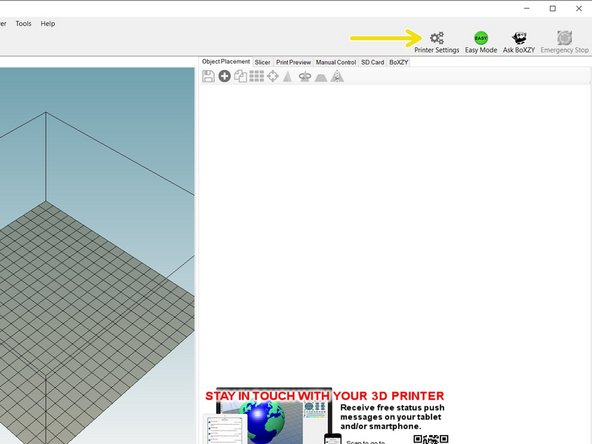
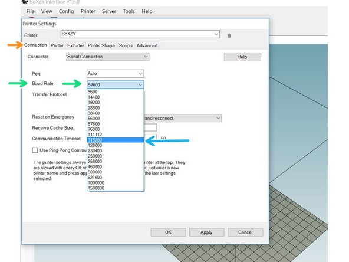
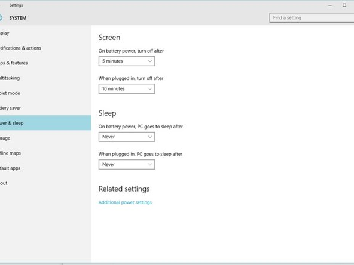

# 1.2 Setting Up Your BoXZY

**By beginning this manual we assume you have read and understood the following manuals and wiki. If you have not read them, please do so now.**

 * [Preparing to use BoXZY](Preparing_to_use_BoXZY.md)
 * [0.1 BoXZY Safe Use](01_Boxzy_safe_use.md)
 * [1.1 Un-Boxing Your BoXZY](11_Un_boxing_your_Bozxy.md)

**A NOTE BEFORE DOWNLOADING THE INTERFACE:**

The BoXZY Interface is intended for computers running Windows XP or later. Solutions for Mac users can be found [here](Boxzy_for_mac.md).

When you’re new to the interface, it’s really easy to accidentally change settings without realizing it. If you experience any undesired behavior, the best thing to do is close the interface. Before doing so, you should disconnect your USB cord from your computer, which will allow the program to close properly. Your interface will revert back to the correct settings as long as you didn’t save anything.

## Step 1 — Installing Arduino

 * [Click here to locate the download for Arduino 1.6.10. or later](https://www.arduino.cc/en/Main/Software)
 * Select Windows Installer, indicated by the red box in the first image for this step.
 * Select "JUST DOWNLOAD" or "CONTRIBUTE & DOWNLOAD" as indicated by the pink box in the second image.
 * Follow the prompts to download the file.
 * Locate the installer file you just downloaded, right click on the file, and select open.
 * Follow the prompts that Arduino provides you to install the Arduino software.

## Step 2 — Installing the BoXZY Interface: Part 1

 * The BoXZY Interface is how you will control your BoXZY
 * You must be logged into Windows as an administrator to download and use BoXZY Interface, or the BoXZY Interface will not populate with BoXZY's settings. Please follow these directions carefully to install the Interface correctly
   * [Download the BoXZY Interface here!](https://drive.google.com/file/d/0B0gOyqLrz4L-TG14T2d5REdyUmc/view?usp=sharing)
      * [BoXZY interface 2.0.1](https://drive.google.com/file/d/0B0gOyqLrz4L-ZEcxQ2E2dnVsTlU/view?mc_cid=ac5bc3194c&mc_eid=5116e89b37)
 * Locate the BoXZY Interface file you just downloaded. Right click on the file and select ''Open"
   * Follow the installer prompts. Do not change anything during the installation
   * Make sure to click allow when it asks if you want it to create a shortcut
   * You will be asked to install Repetier-Server after the BoXZY Interface has been installed. Select "OK" and continue to follow the Repetier-Server installation prompts

## Step 3 — Connecting to BoXZY

 * Plug BoXZY into the outlet on your Power Station. The Power Station provides power to BoXZY. It has an e-stop (emergency stop) button, a key switch, and a power indicator light that glows green when power is on.
   * Connect the Power Station to BoXZY before you plug the Power Station into the wall outlet. The BoXZY Team highly recommends using a surge protector or power strip between the Power Station and wall outlet.
   * Find the key that came in the BoXZY Power box and turn the keyswitch to the ON position, as indicated by stickers around it. Release the e-stop. Verify that power is on by checking the green indicator light.
 *  Plug the Power Station cord into your BoXZY. The blue arrow in the second image shows where to plug the Power Station cord into BoXZY's electronics enclosure.
 *  Plug your USB cable into BoXZY, indicated by the green arrow in the second image. Plug the other end of the USB cable into your computer's USB port.
 *  Turn the switch on the bottom of the electronics enclosure to the ON position. This is indicated by the purple arrow in the second image for this step. Check for airflow under the enclosure to verify it is switched ON. You should hear the fans running.

## Step 4 — Installing the BoXZY Interface: Part 2

 *  Open your BoXZY Interface. We put a shortcut on our Desktop, or find the Interface in your Windows Apps or Programs directory. The red arrow in the first image for this step indicates the BoXZY Interface icon.
 * There will be a preloaded .STL file when you open the BoXZY Interface for the very first time. You can ignore this file for now.
 *  Select the Printer Settings button in your BoXZY Interface, as indicated by the yellow arrow in the second image for this step.
   * When the Printer Settings window opens, select the Connection Tab, as indicated by the orange arrow in the third image.
 *  Look at the Baud Rate, if it does not have the value of 115200 then you will have to change it, if it does have it continue with the next step of this guide
   *  To change the Baud Rate, select the Baud Rate drop down menu and select 115200
 * Select "OK" to save
 * The Printer Settings window contains critical software settings that allow your BoXZY to work. It is important that you do not change any other settings until you are an expert BoXZY user.

## Step 5 — Disable Windows Power Saving Features

 * You'll want to disable Windows' default power management settings before you start to mill, print, or etch with BoXZY. When features like Hibernation Mode and Sleep turn on, they can break communication between BoXZY and the interface. This can cause serious errors and may ruin your print, etch, or milling job.
 * Check out this link for instructions on how to access and change your power management settings. There are instructions for Windows 10, 8, 7, Vista, and XP.

## Step 6 — Controlling BoXZY

 * Now that you're set up and ready to go, you can follow our guides for using BoXZY.
 * [The Next Step: 1.3 - Using Your BoXZY](13_using_your_Boxzy.md)
