# 1.3 Using your BoXZY

By beginning this manual we assume you have read and understood the following manuals and wiki. If you have not read them, please do so now.
 * [Preparing to use BoXZY](Preparing_to_use_BoXZY.md)
 * [0.1 BoXZY Safe Use](01_Boxzy_safe_use.md)
 * [1.1 Un-Boxing Your BoXZY](11_Un_boxing_your_Bozxy.md)
 * [1.2 Setting Up Your BoXZY](12_setting_up_your_Boxzy.md)

## Step 1 — BoXZY and the BoXZY Interface

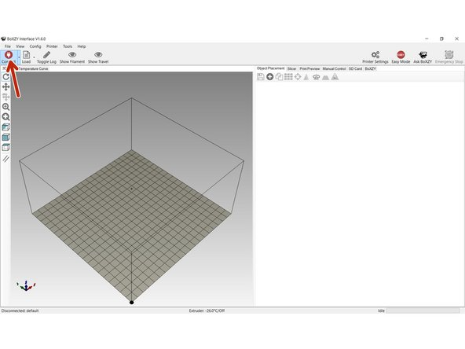
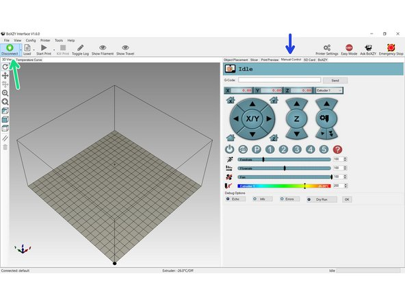

 * This guide assumes that your machine is powered on and ready to use as explained in step 3 of 1.2 Setting Up Your BoXZY.
 * In the BoXZY Interface click the red Connect button, located at the top left corner of the interface (as indicated by the red arrow in the first image for this step).
 * You may hear a single "click" sound come from BoXZY. Do not be alarmed. This is typical. This sound is the motors receiving power.
 *  After you click it, the Connect button will turn green and will read Disconnect underneath (as indicated by the green arrow in the second image for this step). You can only control BoXZY when this button is green.
 * There are two basic parts of the BoXZY Interface: the left side of the window and the right side. On the left side is the 3D view window. On the right side are the settings and control menus. You can make either side larger by clicking and pulling the center line to one direction.
 *  On the right side of the BoXZY Interface select Manual Control from the row of settings and control tabs (as indicated by the blue arrow in the second image).
 * The Manual Control Tab is the mission control center for directly moving and controlling your BoXZY Attachment Heads.

## Step 2 — Manually Controlling BoXZY

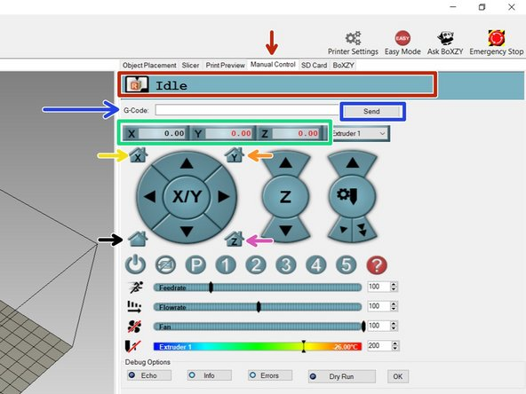

 *  In your Manual Control Tab you will see a status header that says "Idle" (as indicated by the red arrow in the first image for this step.) This means that no commands are being sent to BoXZY. When you're 3D printing or milling, the header will read "Printing Job ETA <time>" when commands are being sent and/or executed by BoXZY.
 *  Below the status header you will see an input line that reads G-Code with a button that says "Send" (as indicated by the blue arrow and box in the first image). This input line allows you to manually enter codes to move your BoXZY. There will be more on this in following steps.
 *  The green box in the first image shows BoXZY's current position (in millimeters) from the home position.
 * You will need to "home" BoXZY each time you reconnect or power down the machine, so the machine is accurate. You should never have an attachment installed or material in the bed when you first home BoXZY or it may cause a machine crash
 *  Let's home the X axis. Select the home icon with an X as indicated by the yellow arrow in the first image. The X axis will now move to its home position and push against the minimum limit switch twice to check that it's in the right position.
 *  Let's home the Y axis. Select the home icon with a Y as indicated by the orange arrow. The Y axis should now do its homing sequence as described above.
 *  Let's home the Z axis. Select the home icon with a Z as indicated by the purple arrow. The Z platform will now move upwards toward the attachment mount and bounce against its minimum limit switch twice.
 * Congratulations you've now homed BoXZY for the first time!

## Step 3 — Moving BoXZY with Manual Controls: Part 1

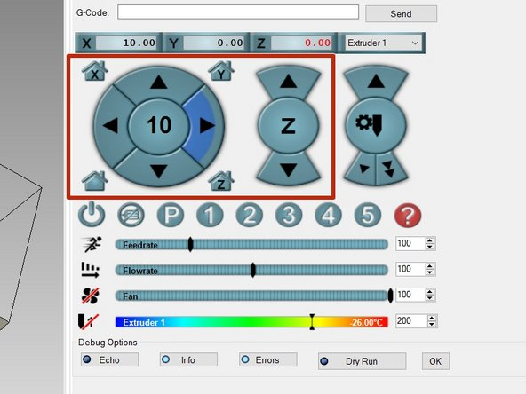

 * On the left side of the red box in the image, there's a circle with a number in it (we'll explain this in Step 4) and triangles that point up, down, left, and right. These buttons manually control the X and Y axes.
 * The control buttons that move the X axis are the triangles that point left and right. Hover over one of these triangles. When a positive number appears in the center of the circle, click on the triangle and the X will move.
 * The control buttons that move the Y axis are the triangles that point up and down. Hover over one of these triangles. When a positive number appears in the center of the circle, click on the triangle and the Y will move.
 * On the right side of the red box, there's a circle with "Z" in the center and triangles that point up and down. These buttons control the Z axis. Click the positive button and watch the Z move.
 * BoXZY's build area is 165mm x 165mm x 165mm. There are limit switches that prevent the Attachment Mount from trying to move past the 165mm physical limit in any direction. When BoXZY contacts these limit switches it will stop that axis from moving any further, but it will continue to execute all other commands.
 * Moving the X or Y a positive direction will move the X or Y axis away from the home limit switch. Moving the X or Y in a negative direction will move the axis toward the home limit switch.
 * Moving the Z in a positive direction will increase the distance between the build plate and the Attachment Mount by moving the build plate towards the bottom of your BoXZY.

## Step 4 — Moving BoXZY with Manual Controls: Part 2

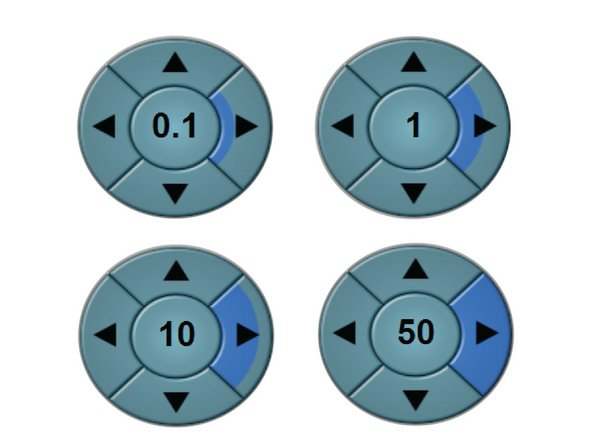
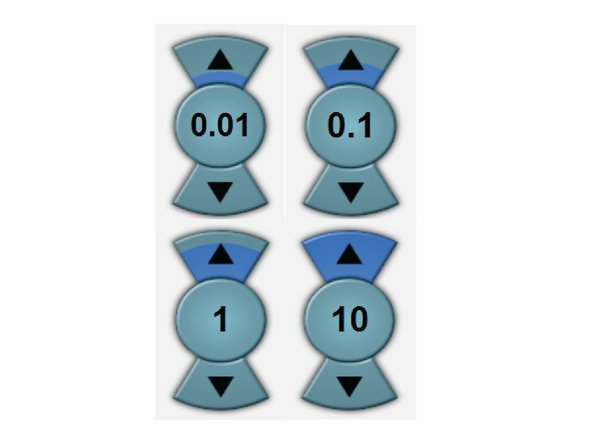

 * You can adjust the increments in which the X, Y, and Z axes move by clicking on different regions of the triangle buttons, indicated by blue shading in both images. The smaller the region of the button you select, the smaller the increment of movement.
 * The first image shows you side-by-side copies of the same X and Y manual control button, each with a different increment (in millimeters) selected for the X axis movement. The selected increment is the number in the center of each button.
 * The second image shows you side-by-side copies of the same Z axis manual control button, each with a different increment in (millimeters) selected for the Z axis movement.
 * Be careful when using the manual control buttons. If you double-tap the increment, you will move that distance twice with almost no pause in between each move.

## Step 5 — Sending Single Lines of G-code to BoXZY

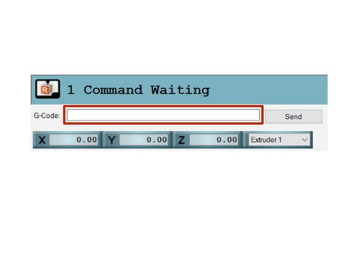
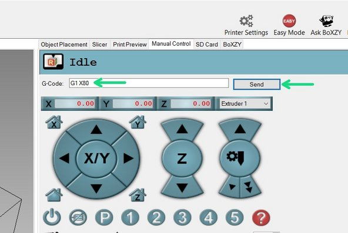

 * G-code is the language BoXZY understands. It's how BoXZY knows what to do. When you press a manual control button, the interface automatically sends G-code to BoXZY. You can also enter this code manually.
 * In any order, select the X home button, the Y home button, and the Z home button to move all 3 axes to their home position.
 *  The BoXZY G-code sender input line is shown in the red box in the first image for this step. This is where you manually enter G-code to send to BoXZY.
 *  Type the following into your G-code sender line: G1 X80. Send this G-code to BoXZY by clicking the Send button. The green arrows in the second image show you these two actions.
   * The G1 command is the Go To command. As you've now seen, our example G-code, "G1 X80," tells BoXZY to move the Attachment Mount along the X axis to the location that is 80mm away from the home location.
   * G-code is very simple, but BoXZY is sensitive to formatting. Pay attention to spaces and use your caps lock key.
 * If you want to move more than one axis at a time, you can. One example is G1 X10 Y20 Z30. This command will move all 3 axes at once to varying positions. Give it a try, listen, and watch as BoXZY moves all of its parts. It's that simple.
 * You now have full 3 axis control over your BoXZY!

## Step 6 — Playing with BoXZY and G-code

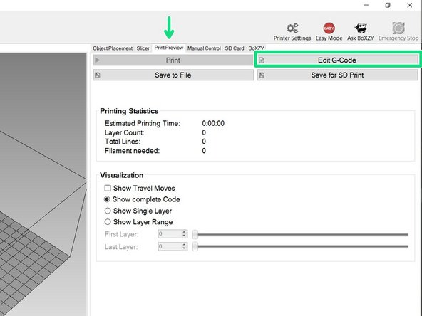
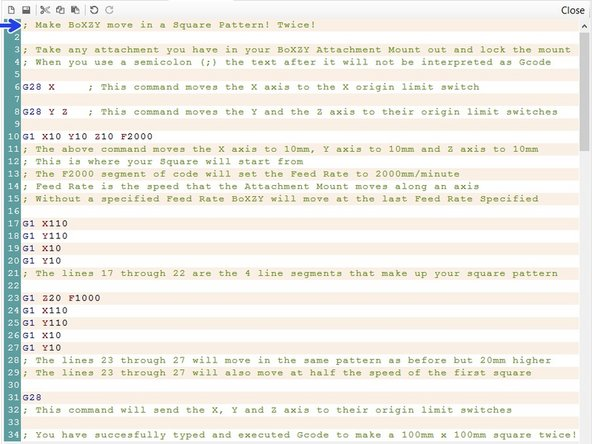
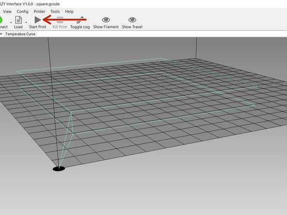

 * Most G-code will be produced for you by the BoXZY Interface or by your CAM software (more on this later). Multiple lines of commands to be sent to BoXZY at one time are called scripts. Though these scripts are generated by software, you can also write your own.
 *  We've made our own Gcode commands, now let's make our own G-code script. Select the Print Preview tab (indicated by the green arrow in the first image), then select the G-Code Editor button (indicated by the green box). You now have access to the G-Code Editor.
   * This is where any G-code script waiting to be started is stored. Scripts contain all the commands required to produce your 3D print, laser etching, or milling job. You shouldn't need to edit your G-code scripts until you've mastered how it works. For now, let's play around with making our own.
   * BoXZY's G-code is case and formatting sensitive. They are read line by line and are followed in order.
 *  Following the example in the second image, type each line into your G-Code Editor. You only need to copy the text in blue and red. The comments are there for your reference.
   * Double-check the G-code after you input it into the editor. Remember the lines that begin with a semicolon ( ; ) are comment lines that will not execute as commands. BoXZY ignores them. You can add your own comments by using a semicolon at the beginning of the line.
 * In the 3D preview window on the left side of the BoXZY Interface, you will see your G-code represented in 3D. You can see this represented by the light blue lines in the third image. Note: You'll discover when you learn to mill that not all codes will give you a 3D visual representation in the preview window.
 *  Verify that there are no Attachment Heads in the Attachment Mount, that the clamp is locked, and the machine is in its "home" position. Then select the Start Print button in the upper left hand corner of the BoXZY Interface (indicated by the red arrow in the third image). Now watch: BoXZY is following your commands.

## Step 7 — Loading/Saving in the G-Code Editor

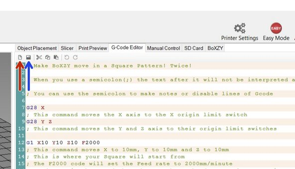
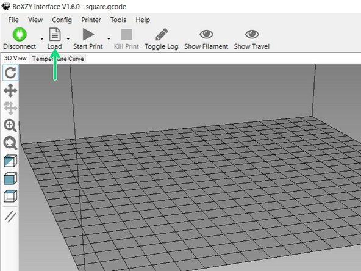

 * The blue arrow in the first image denotes the Save button in your G-Code Editor.
   *  Select the Save button and save the G-code script as "Test.Square" so you can return to it and reference the script later.
 * The red arrow in the first image indicates the New Text button in your G-Code Editor.
   *  Before you work with a new file of any type, make sure you've already saved your current script in the G-Code Editor. Any current script will be overwritten upon loading a new file. Use the New Text button to clear out any code in your G-Code Editor when manually writing your own.
 *  To load a new G-code file, select the Load button from the top left corner of your BoXZY Interface (indicated by the green arrow in the second image) and locate the file. This button is used in later guides to open other types of files.

## Step 8 — Using your E-stop

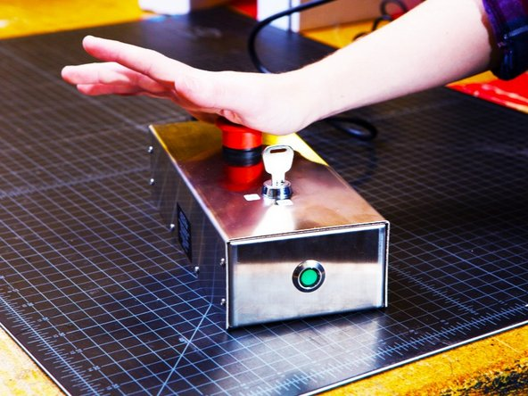
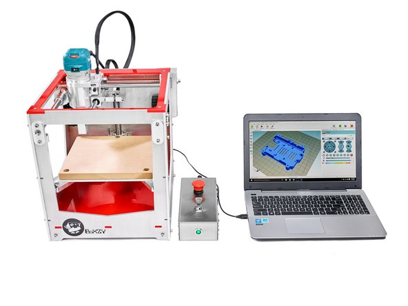
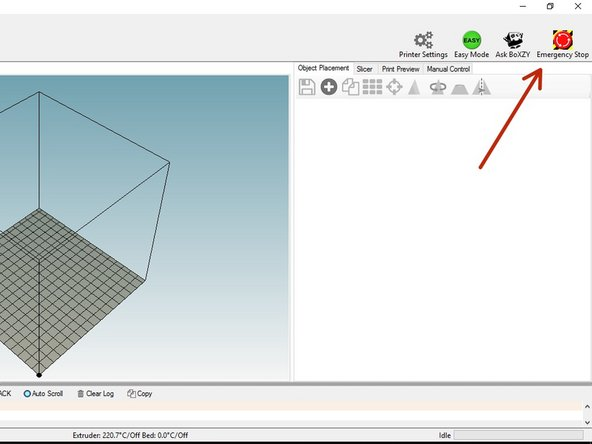

 * BoXZY's Power Station has an Emergency Stop button or e-stop that allows you to immediately stop mistakes once they start. You should always plug your milling head into the Power Station, so that it will stop along with BoXZY if you use the e-stop when milling.
 * Let's practice using it. Press play on your new G-code script so it starts to run.
 * About halfway through, hit your big, red, physical e-stop switch on the Power Station, as shown in the first image. This will stop the machine in its tracks.
 * Now you have stopped the machine from running. We're not ready to twist the button to release just yet. The red arrow in the third image shows the software e-stop button in the upper right corner of the interface.
 * Now click the software e-stop button. You may hear two small clicks come from the machine when this happens.
 * You can now twist the physical e-stop button to release it and resume power to BoXZY. You will need to re-home or re-zero the machine whenever you hit the software e-stop. Do that now.
 * You should always hit the physical e-stop before placing your hands in the machine. You only need to hit the software e-stop button if commands were sent to the machine while the physical e-stop was compressed. This includes times you forget the physical button is still compressed when attempting to resume using BoXZY.

## Step 9 — Using Your Attachment Heads

 * Before proceeding further, take some time to play around with BoXZY and absorb what you've learned. Make sure you are comfortable with the prior steps and BoXZY's basic functionality before attempting a new guide.
 * Once you have set up and played around with your BoXZY, you can begin to explore using your BoXZY Attachment Heads.
 * Select one of the following links and follow the guide for each Attachment Head.
   * [3D Printing Guide](3D_printing_guide.md)
   * [Laser Etching Guide](Laser_etching_guide.md)
   * [CNC Milling with BoXZY](CNC_milling_with_Boxzy.md)
