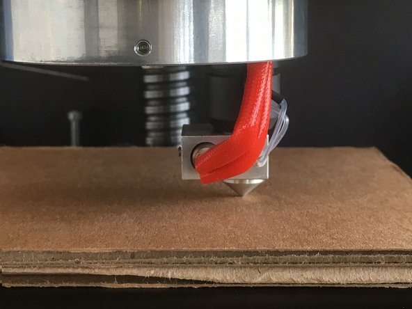
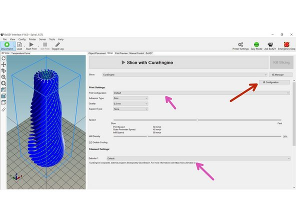
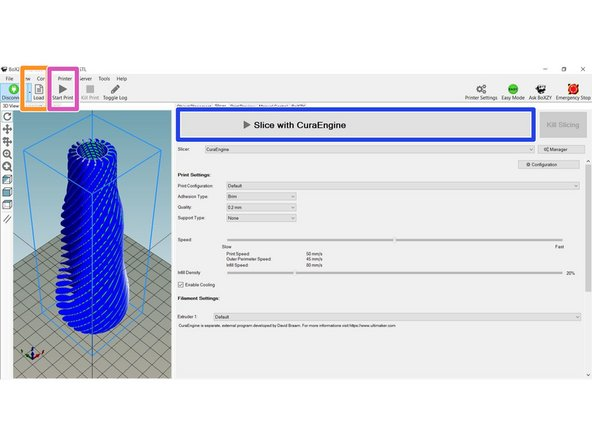

# 3D Printing with BoXZY

By beginning this manual we assume you have read and understood the following manuals and wiki. If you have not read them, please do so now.
 * [Preparing to use BoXZY](Preparing_to_use_BoXZY.md)
 * [0.1 BoXZY Safe Use](01_Boxzy_safe_use.md)
 * [1.1 Un-Boxing Your BoXZY](11_Un_boxing_your_Bozxy.md)
 * [1.2 Setting Up Your BoXZY](12_setting_up_your_Boxzy.md)
 * [1.3 Using your BoXZY](13_using_your_Boxzy.md)

**NOTE TO USERS WITH PRIOR 3D PRINTING EXPERIENCE:**

Did you know you can also use the Cura or Simplify 3D Interface to control BoXZY for 3D printing? You only need to import BoXZY's settings. You'll still need to follow the setup instructions below.

## Step 1 — Preparing for Leveling

 * Always use the physical e-stop on the Power Station to disable BoXZY before putting your hands inside the machine. Remember to release the e-stop by twisting it to turn the power back on.
 * Place your Leveling Platform in BoXZY so that the 3 magnets on the underside line up with the 3 bolts on the Milling Platform, as seen in the second and third images.
 * It is very important to reposition the platform magnets firmly over the bolt heads every time you take off the Leveling Platform. Verify it does not rock, even slightly. Use some pressure to make sure it is well-seated.
 * Open the Manual Control tab in the BoXZY Interface. Home the X, Y and Z axis.
   * If you do not remember how to do this, refer back to our [Using Your BoXZY guide](13_using_your_Boxzy.md).

## Step 2 — Leveling the Platform: Part 1 

 * BoXZY uses 3-point leveling to make sure the nozzle moves perfectly parallel to the platform during X and Y movements. This is a very important initial setup step that only needs to be repeated if the bolts are moved.
 * While the Attachment Mount is still empty, use the BoXZY Interface to move the mount above the middle, back bolt on the platform.
   * The G-code that will position BoXZY where you want it is: G1 X1 Y82.5. You an also use the manual control buttons.
 * Remove your 3D Printing Head from the white box marked "3D Printing." Always pick the attachment up by its handle.
 * You'll usually want to use a business card to level your platform, but if this is your very first time doing it, follow the guide steps using a very thick, flat piece of cardboard instead. This reduces your risk of crashing the nozzle. You'll repeat the leveling procedure with a business card after your first try with cardboard.
 * Place the business card directly underneath the Attachment Mount on the Leveling Platform. There should be no tape on the platform during leveling.
 * Unlock the Attachment Mount clamp. Insert your 3D Printing Head so that the nozzle sits directly on top of the business card, as shown in the second image and the third image with cardboard. Lock your 3D Printing Attachment with the clamp, as shown in the first image. Adjust the clamp as necessary. Do not plug the cable in yet.
   * Always verify that your Z is at its home position before inserting the attachment. Otherwise scary noises and damage can occur! The nozzle should be positioned in the Attachment Mount for leveling as shown in the second image.

## Step 3 — Leveling the Platform: Part 2 

 * While the 3D Printing Head is still locked into the Mount, pull the business card out from underneath the nozzle. This should create a slight mark on the business card. Label this mark "Back."
 * Send your 3D Printing Head to the front left corner of your BoXZY. The G-code is: G1 X165 Y1 but you can also use the manual control buttons.
 * Slide your business card under the nozzle again. You're going to make a new mark this time, so slide it in a different place than before. Use a 3mm Allen key wrench to raise or lower the bolt in that same corner, as seen in the first image. Adjust this bolt until the mark on the business card matches the first one in depth. Label it "Left."
 * Repeat this step for the front right corner of your BoXZY. The G-code to get there is: G1 X165 Y165. Label the new mark on the business card with "Right."
 * There should now be 3 marks on the business card that match in depth for "Back," "Left," and "Right."
 * Return to the very first leveling step and repeat the leveling process, including removing and re-inserting the attachment. It is important you complete this entire process a minimum of 2 times. Once this is done, you have completed the leveling process.

## Step 4 — Choosing a Printing Surface Covering 

 * To yield the best possible results, it's important to apply a printing surface to your Leveling Platform. This helps the 3D print stick to the platform and encourages first layer adhesion. Your 3D prints will not adhere directly to the metal Leveling Platform.
 * If you're just starting out with 3D printing, we recommend using Scotch Contractor Grade Masking Tape To get the best results with it, lightly sand it with 80 grit sandpaper to rough up the surface a bit. Wipe that down with Windex and let it dry before printing. Older tape that has been printed on a few times wears in and works better with age.
 * You can also use masking tape or Kapton Tape as a printing surface. BuildTak is one option made specifically for this purpose.
 * Remove the Leveling Platform to apply your chosen printing surface to it.

## Step 5 — Plugging in the 3D Printing Head 

 *  Your BoXZY is always ready for Milling when there is no Attachment Head plugged into the Attachment Mount. In this state the temperature should read -27C. Please verify this by looking at the temperature reading in the Manual Control tab as shown by the red arrow in the first image.
 *  There is a log at the bottom of the screen that is visible when you select Toggle Log. If it is not visible, click the button shown by the blue arrow in the third image to select it.
 *  Plug the cable marked "quick-change head" into the 3D Printing Head, as seen in the second image. Pink arrows indicate where the cable plugs in.
   * When plugging your cable in, be sure you have the plugs squarely aligned, as you did with the Attachment Mount and limit switch during your first setup.
   * Be aware off the quick-change head and limit switch cables when using BoXZY. They can easily fall over and catch on one of BoXZY’s corners while in use. To avoid this, you can zip tie them together or 3D print a cable guide for BoXZY by following this [link](https://www.thingiverse.com/thing:1367873).
 * This is the connection you should use to plug in or disconnect your Attachment Heads. Leave the cable plugged into the machine, but make sure it's out of the way while you work.
 * The log should say "3D printer head detected" when you plug in the 3D Printing Head and "Milling head detected" when you remove it. If you missed it, watch it as you disconnect and reconnect the harness. The temperature should now show between 20-30C if the nozzle is at room temperature.
 * Never unplug the harness while the 3D Printing Head is heating or the fan is running.

## Step 6 — Checking Your Filament Drive 

 * Next, let's get familiar with the Filament Drive, an integral component of the 3D Printing process. The Filament Drive can be seen in the first image.
 *  Verify the spring has not cocked to one side and is straight as shown by the blue arrow in the second image. Now look at the first image. Insert a piece of paper between the Filament Bearing (the part to the right of the blue arrow in the first image) and the Filament Drive Gear (the part to the left of blue arrow).
 *  Push up on the Filament Drive Lever (shown by the pink arrow in the first image) to widen the gap between the Filament Gear and Filament Bearing.
 *  Adjust the Filament Drive Lever Tension Bolt, shown by the orange arrow in the third image, so that the piece of paper between the Filament Bearing and Filament Drive Gear is tight but may be pulled out without tearing.
   * Be careful not to unscrew the Tension Bolt too far or the nut will come off the bolt and the spring will come off!
 * From time to time when you're 3D printing, you'll need to clean plastic out of the Filament Drive Gear's teeth. You can use a piece of dental floss for this.

## Step 7 — Testing the Filament Drive

 * Before you get started, you'll need some filament. We recommend printing with Hatchbox PLA until you’re comfortable 3D printing on BoXZY.
   * We don’t recommend changing any printer settings or using different brands/types of filament until you’ve done a few successful prints with Hatchbox PLA.
 * Cut off the very end of your filament if it is damaged or widened, then straighten the first 3" so that it is completely straight. This will keep the filament from catching internally.
 * Squeeze the Filament Lever.
 * Insert your filament through the opening on the underside of the Filament Lever. This will allow it to travel between the Filament Drive Gear and Bearing. Do this so that it sticks up out of the Filament Drive about 1", as seen in the first image.
 * Use the Manual Extrude button in the Manual Control tab to "extrude" 100mm of filament, as shown by the red arrow in the third image. Try to keep the filament from moving with 2 fingers while your hand is stationary, as shown in the second image. The machine should be able to pull filament through your squeezed fingers if tensioned correctly.
 * Now you've completed testing your filament drive!

## Step 8 — Testing your Extruder/Hotend 

 * Note: People frequently use the terms Extruder, Hotend, Nozzle, and Printer Head interchangeably when talking about 3D printing.
 * Lower your Z with a G1 Z100 code.
 * Once again use a straightened length of filament and insert it directly into the white filament tube coming from the 3D Printing Head. Push the filament until you can no longer push it. Make sure you leave the 3D Printing Head in the Attachment Mount.
 *  Using the Manual Control tab, turn your extruder heater on to 210 C. First select the extruder icon, shown by the red circle in the first image. Then either drag the temperature bar to 210, or type 210 into the temperature setting box, shown by the red arrow. You must de-select the box or press tab when finished for the setting to be saved.
 *  Check that the nozzle reaches the target temperature from the reading shown in the first image. There are two different places where you can check this and they're both indicated by a pink arrow.
   *  When it reaches 210 C, use your hands to hold the filament tube and push the filament into the 3D Printing Head, as shown by green arrows in the second image.
   * This will require a fair amount of force. Remember you are pushing a 1.75mm piece of plastic through a 0.4mm hole
   *  Once you see filament coming out of your extruder, like in the third image, push a few inches of filament through. You have now verified the 3D Printing Head is working correctly.

## Step 9 — Pre-print Setup

 *  While your extruder is still hot, pull the filament completely out of the filament tube. Turn your Extruder Heater OFF (shown by the pink box in the first image).
   * Always verify the heater is off when finished. Leaving the extruder heated in the manual control window without extruding for extended periods will over-bake the plastic and lead to nozzle clogging.
 * Cut off the melted end of your filament and straighten the first 3" again.
 *  Insert the Filament Tube into the Tube Quick-Release Fitting, shown by the green arrow in the second image. Pull up on the Filament Tube to make sure it's locked in place. If it becomes unlocked during a print, the printer will not be able to extrude.
   * Whenever you go to remove this tube, push both the tube and the Quick-Release Fitting downward. Then tightly hold the top of the fitting all the way down and pull upward on the tube.
 *  As shown by the blue arrow in the third image, insert the filament upwards through the Filament Drive and on through the Filament Tube. Push it the entire way into the 3D Printing Head, until you cannot push it further. This is where the straightness of the initial filament really matters.
 * Double-check that your spool of filament is able to rotate freely, so that filament can unravel smoothly as the Filament Drive pulls it.
 * Reheat the extruder to 210 C and use the manual control buttons to extrude 100mm of filament so that you are sure the filament has made it all the way to the nozzle. Turn the Extruder Heater OFF once finished.

## Step 10 — Load and Print a Test Print

 * Before we get into "slicing" within the BoXZY Interface, we want to test that the physical machine is functioning properly as a unit. We will do this by running a pre-sliced print file.
 * The 3D Printing Head should still be installed from the leveling process. Any time you remove the 3D Printing Head, you must home the Z axis without an Attachment Head installed before you reinstall one. When you reinstall the 3D Printing Head, place a business card between the nozzle and the platform before clamping it in place.
   * The gap the business card creates when it's removed is your first layer printing height. You can use shims of varying thickness in place of the business card for fine tuning. This must be done over any tape or printing surface. The current settings are for the thickness of the card when the nozzle creates a light groove.
 * Download the test print G-code at this link.
 *  In the BoXZY Interface, load the G-code by selecting the Load button (indicated by the red arrow in the second image) and locate the test print that you just downloaded.
 *  Select the Start Print button (indicated by the blue arrow in the second image) and watch it print!
   * The printer will home itself, then take about 3 minutes to heat up before resuming the print.
 * If the object looks as represented in your preview window, you've just completed your first successful print!

## Step 11 — Checking Your Printer Settings

 * Before you print a 3D model of your choice, you need to check your Slicer Configuration Presets. The "Slicer" is the program that produces a G-code script based on the 3D model you want to print.
 *  Following the first image, select the Slicer tab in your BoXZY Interface. Verify that Slicer is set to "Slic3r" and that Print and Printer Settings are set to "BoXZY." These settings are indicated by red arrows in the image.
   *  Select Extruder 1 and verify the "BoXZY PLA" profile is selected
 *  Now select the Slicer tab in your BoXZY Interface and verify that the Slicer is set to "CuraEngine" and that the Print Configuration is set to "BoXZY." These settings are indicated by green arrows in the second image.
   *  Select Extruder 1 and verify that the "BoXZY PLA" profile is selected.
 * Slic3r and Cura are two different programs for the same task. We recommend running your first print using both Slic3r and Cura so you get a sense of how each works and differs.

## Step 12 — Changing Temperature and Fan Settings

 * Depending on your chosen filament brand, you may need to adjust the Print Temperature and Fan Speed. BoXZY's stock settings work well for Hatchbox 1.75 PLA or ABS filament. Note: image 1 doesn't show the BoXZY profiles selected. You need to select them as mentioned in previous steps.
   * Changing the temperature or fan speed in the Manual Control tab will only momentarily change the settings during a 3D print. They will quickly revert back to default mid-print because those settings are stored in the G-code script. Keep reading to learn how to change them for the entire print.
 * The Slicer, in this case Cura or Slic3r, produces G-code script/commands for a 3D print. You fine-tune print quality with their settings. Many factors can affect results including room temperature, filament brand, speed, etc. You'll constantly learn about and adjust slicer settings. Check the bottom of the page for resources to help you.
 *  In the Slicer tab, select the slicer you'd like to adjust. Click the "Configuration" button on the right under the large "Slice with" button (shown by a red arrow in the first image). For Slic3r, a new window will appear after several seconds (it's very slow). With Cura, the window will appear on the left side of the interface.
   *  Select the Filament tab as shown with the green arrows in the second and third images.
   * This is where you adjust temperature and min/max fan speed. Changes must be made before you slice your file. There will be multiple profiles, so make sure to select the one you wish to modify (shown by orange arrows in images 2 and 3). Click save when done and select that profile for slicing as shown by the pink arrows in image 1.
 * You'll notice other dropdown bars in the Slicer window. You can use those to select options such as printing supports or a brim. A support is an additional printed structure that stabilizes overhangs while they're printing. A brim will extend the base of the part to increase its first layer surface area and increase platform adhesion.
 * Save your original profile and keep it available so you can revert back to it, if needed. When modifying your own profile, if you increase resolution from the stock resolution setting, reduce print and movement speeds proportionately or you increase the chance of missing steps or skips.

## Step 13 — Loading Your 3D File

 *  Click the Load button (circled in yellow in the first image) to load your 3D file. Your file should be a .STL file type. Most CAD programs will allow you to save or export as this file type.
 * When in the Object Placement tab, the screen is a digital representation of BoXZY's Leveling Platform. Once you load a 3D file, it will allow you to move and scale your object relative to the print area, prior to slicing.
   *  Use the Center Object button (indicated by the pink arrow) if you want to move the object to the center of the platform.
   *  You can Scale your 3D file inside the window if it's too big or too small, as shown by the orange arrow.
   *  You can Rotate the object in any dimension on the platform. Use the rotate functions shown by the blue arrow.
 * A 3D file can be saved or exported in inches versus millimeters. Make sure you select the right units based on the file you're loading, as shown in the second photo.

## Step 14 — Loading Your Design, Slicing, and Printing

 * Now that everything is set up, verified, and tested you will only have to follow these steps to print with BoXZY when you so desire:
 * Insert filament.
 * Apply your printing surface (e.g. masking tape), home the Z, then insert your 3D Printing Head over a business card. Lock the Head in with the lever and remove the business card. (You do not need to repeat this process between prints unless you loosen or remove the Head.) Make sure your platform has a printing surface and nothing else on it.
 *  Click Load to load your STL 3D file, as shown in the orange box in the image. Search Thingiverse if you would like to find one, or design your own in Fusion 360.
 *  After selecting your preferred slicer and settings, click the Slice with button, shown in the blue box in the image, and allow it to complete.
 * Once it's done slicing the file, the slicer will automatically load the new G-code script into the G-code Editor and show you a 3D preview of the G-code.
 *  Just press Start Print (shown in the pink box in the image), wait for it to heat up, and watch it print!
 * If you have any issues with print quality, start to learn about tuning your slicer settings and your machine here.

## Step 15 — Using Other Attachment Heads 

 * [Laser Etching Guide](Laser_etching_guide.md)
 * [CNC Milling with BoXZY](CNC_milling_with_Boxzy.md)
