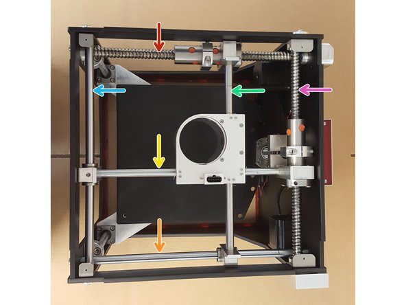
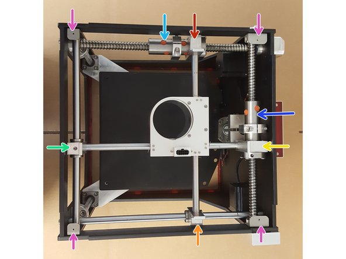
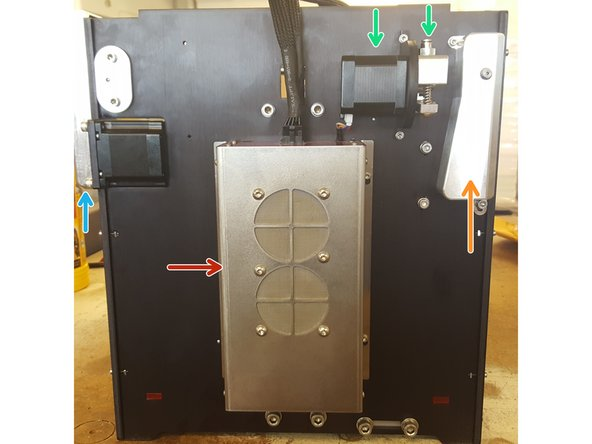
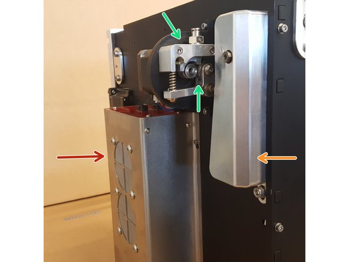
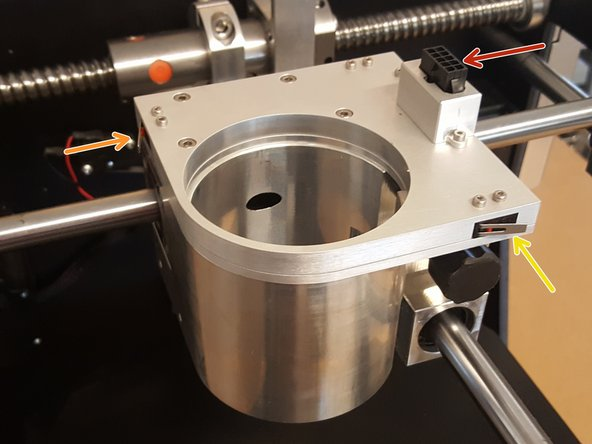
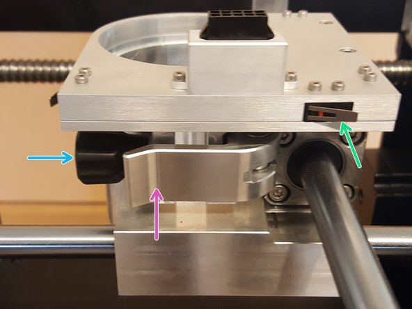
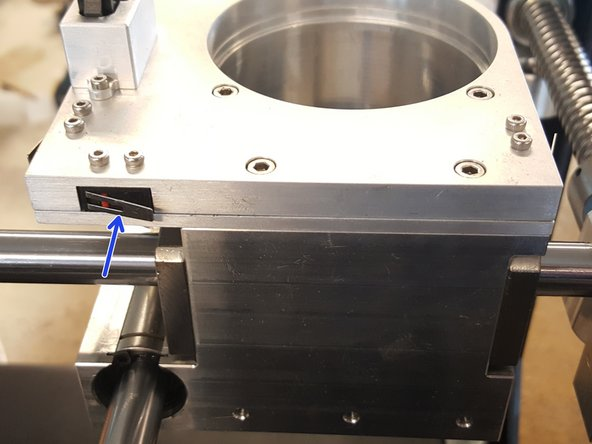
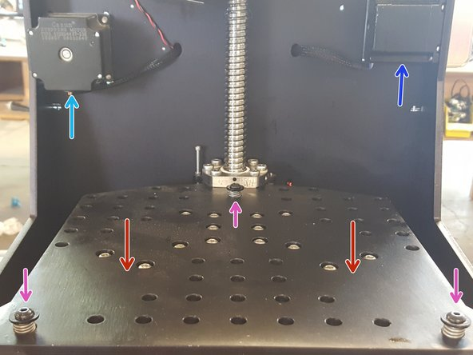
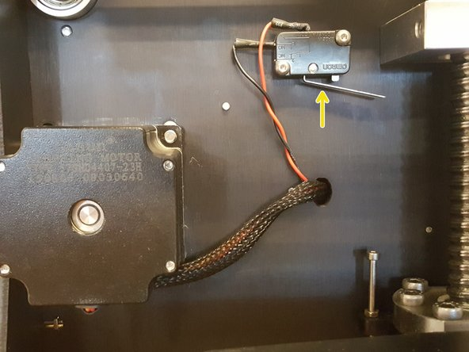
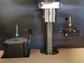

# BoXZY Parts and Terminology

## Step 1 — Examining BoXZY Top-Down: Part 1 

 * BoXZY is built inside and around an aerospace grade aluminum frame.

 * The image in this step points to the X and Y linear motion components. The image's colored arrows correspond with the matching bullet points below. BoXZY is oriented so that its front is facing the left and its back is facing the right.

 *  X Axis Ball Screw
   *  X Axis Attachment Mount Rod
   *  X Axis Rod
 *  Y Axis Ball Screw
   *  Y Axis Attachment Mount Rod
   *  Y Axis Rod

## Step 2 — Examining BoXZY Top-Down: Part 2

 *  X Axis Ball Screw Bearing
   *  X Axis Ball Screw Mount
   *  X Axis Rod Mount
 *  Y Axis Ball Screw Bearing
   *  Y Axis Ball Screw Mount
   *  Y Axis Rod Mount
 *  Mounting Brackets for the top acrylic panel

## Step 3 — BoXZY's Back End 

 *  Your BoXZY houses its electronics in an aluminum electronics enclosure with mounted fans.
 *  The X Axis Stepper Motor Belt is in a CNC-machined aluminum casing.
   *  The Y Axis Stepper Motor Belt Cover is on the left side of your BoXZY, when looking at it from behind.
 *  The Filament Drive System (shown by green arrows in the first and second images) is mounted and open to allow easy access to it.

## Step 4 — The BoXZY Attachment Mount

 * These images depict your BoXZY's Attachment Mount. You might also see this sometimes referred to as the "gantry."
 *  Limit Switch Cable Connection (first image)
 *  Y Axis Minimum (Origin) Limit Switch (first image)
   *  Y Axis Maximum Limit Switch (second image)
 *  X Axis Minimum (Origin) Limit Switch (third image)
   *  X Axis Maximum Limit Switch (first image)
 *  The BoXZY Attachment Mount has a Locking Clamp (second image). When unclamped, you can slide BoXZY's Attachment Heads in. When clamped, the Attachment Heads are locked in.
   *  The Locking Clamp has a Lock Adjustment Knob (second image).

## Step 5 — Examining the Inside of BoXZY

 *  Your BoXZY uses a vertically moving Milling Platform with drilled holes that allow for custom fixturing and workholding.
 *  On the Milling Platform there are three Leveling Bolts with springs (shown by purple arrows in the first image). These are used to precisely adjust the Leveling Platform (not pictured) that is installed on top of the Milling Platform as a 3D printing/laser etching surface.
 *  X Axis Nema 23 Stepper Motor (first image)
 *  Y Axis Nema 23 Stepper Motor (first image)
 *  Z Axis Nema 23 Stepper Motor (third image)
 *  Your BoXZY has 2 Z Axis Limit Switches mounted inside of BoXZY's frame.
   *  Z Axis Minimum (Origin) Limit Switch (second image)
   *  Z Axis Maximum Limit Switch (third image)

## Step 6 — Underneath BoXZY

 * The Z Axis Motor, Belt and Pulley System is mounted underneath BoXZY.

## Step 7 — Return to the BoXZY Manuals

 * Return to [Preparing to Use BoXZY](Preparing_to_use_BoXZY.md).
