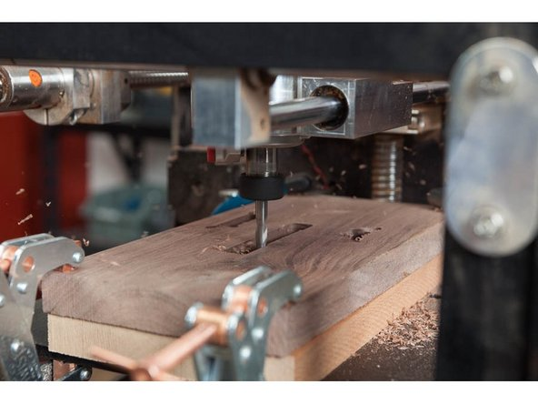

# CNC Milling with BoXZY

By beginning this manual we assume you have read and understood the following manuals and wiki. If you have not read them, please do so now.
 * [Preparing to use BoXZY](Preparing_to_use_BoXZY.md)
 * [0.1 BoXZY Safe Use](01_Boxzy_safe_use.md)
 * [1.1 Un-Boxing Your BoXZY](11_Un_boxing_your_Bozxy.md)
 * [1.2 Setting Up Your BoXZY](12_setting_up_your_Boxzy.md)
 * [1.3 Using your BoXZY](13_using_your_Boxzy.md)

A NOTE TO ADVANCED USERS:

Click [HERE](CNC_terminology.md) for an advanced user wiki to speed up your understanding of BoXZY. Beginners, we recommend against reading this until you have followed through all active instructions and milled some of your own files.

## Step 1 — Milling on BoXZY: From Start to Finish

 * Safety is your top concern when using BoXZY. BoXZY makes CNC milling easier, but there’s always a chance that something can go wrong. Taking proper care and precautions when milling can prevent damage to yourself or your machine. Make sure you understand all instructions and recommendations to avoid unwanted behavior from your machine.
 * These steps summarize how to mill on BoXZY. Each step is a link to a mini-manual that expands on the topic in more detail. Before moving on, please read each mini-manual and then complete the instructions on this page for milling a test file.
 * Verify that BoXZY is connected to the BoXZY Interface and that you have homed your empty machine before beginning these steps.
 * Step 1: Create a file for the object you wish to mill.
 * Step 2: Mount your raw material blank or part.
 * Step 3: Set your Z offset and run an air pass.
 * Step 4: Execute your file and mill your creation!
 * The rest of this manual will guide you through milling a sample file. It's important that you follow this entire manual before attempting to mill your own file.

## Step 2 — Prepare BoXZY for Milling the Test File

 * Un-box your Milling Head and mount the provided 1/4" 2-flute carbide endmill (bit), circled in red in the first image. Careful its extremely sharp!
 * When you install your bit, install it deeply and (as shown in the second image) tighten it enough that your work material won't pull it out, but not too tight or else it could cause other problems. It takes practice out get a feel for the right amount of torque. Err on the side of too tight
 * The Milling Head accepts 1/4" diameter shafts. Many different sized bits and endmills are available with a 1/4" shaft diameter. You can also use a [collet reducer or a custom collet](End_Mills_and_Bits_for_Milling_with_BoXZY.md), for bits with smaller shaft diameters.
 * Once you've installed your bit, set aside the Milling Head for later use.
 * Don't insert the Milling Head into BoXZY or plug it into the Power Station just yet.

## Step 3 — Keep Your E-Stop Within Reach Every Time You Mill

 * Keep your e-stop easily accessible every time you mill with BoXZY. When executing a milling file, whether an air pass or actually cutting into material, keep your hand on the e-stop. Don't be afraid to use it if you see the mill do something you don't like.
 * Refer to Step 8 in [this manual](13_using_your_Boxzy.md) to refresh yourself on the e-stop and how it works, including how to use the software e-stop to clear commands that were sent to BoXZY when the physical e-stop was activated.

## Step 4 — Use the Milling Head as an Alignment Tool

 * Throughout this guide, we'll frequently suggest setting your Milling Head into the Attachment Mount so you can use your bit as a tool to align your material to the Milling Platform.
 * Instead of finding the center of your bit you can use a bit with a sharp point to align to an edge, as shown in the image. Use the pointed bit for alignment and then swap your work bit back into the Milling Head, before setting your Z0.
 * Remember: These are temporary steps: You will still need to properly set up the Z User Home and lock the Attachment Mount prior to running the file.

## Step 5 — Mount Your Material

 * Lower the Milling Platform using the positive Z manual controls (shown in the red box in the first image) to create the clearance you need to mount your material. Move the platform down far enough so that you can temporarily set in the Milling Attachment to use the bit for alignment.
 * The upcoming Milling Test file does not cut all the way through the material, so you do not need to use the sacrificial board for the following steps.
 * Place a piece of wood that is at least 3.5" x 8" x 0.5" in dimension onto your Milling Platform. Align the 8" length so it's parallel with the movement of the Y axis.
 * Firmly secure the wood to the platform. We used nuts and bolts, as shown in the third image, but you can clamp your material instead.
 * Make sure your clamps or bolts are outside of BoXZY's range of travel.

## Step 6 — Insert the Milling Head

 * If necessary, lower the Milling Platform to create enough space in order to install the Milling Head and still leave space between the material and the bit.
 * Insert the Milling Head into the Attachment Mount so that its base is nearly flush with the bottom of the Attachment mount. Then temporarily clamp it in place. Do not connect the Milling Head to power at this time.
 * Now move the Milling Platform back up toward the bit until you’re within roughly 1” of it, but not close enough to touch the bit, as shown in the second image.

## Step 7 — Set the Z Start Point

 * Until you set the Z Start Point, BoXZY does not know where the bit is in relationship to the material. It’s extremely important that BoXZY knows this position in order to mill correctly.
 * Enter G1 X0 Y0 into the G-code input line to send the machine back to its X0, Y0 position.
 * Do not use home buttons or a G28 command. They will undo your User Home position and potentially lead to a crash if anything is inside the machine.
 * Unclamp the Attachment Mount and allow the Milling Head to gently slide down until the bit touches your material, as shown by the red arrows in the first image.
 * Move the platform upwards, allowing it to push the Milling Head up with it until the base of the its outer body is flush or slightly below the base of the Attachment Mount, as shown by the purple arrow in the second image.
 * Type G92 Z0 into your G-code input line and hit Send. This will set the current position of your Z axis as 0
 * Verify your current Z position has been set to 0 by entering G1 Z0. It should not move.
 * Clamp your Attachment Mount. If the attachment can rotate with careful but firm pressure, the clamp should be tightened. Check that the clamp is completely pushed in whenever you're milling.

## Step 8 — Run an Air Pass

 * Your milling files won't always execute the way you expect them to. An air pass will let you know what you're in for.
 * Performing an air pass before every milling file will help you prevent unwanted behavior like the bit cutting your clamps, cutting the file in the wrong location, or moving too fast or too slow.
 * Unclamp the Attachment Mount and pull the Milling Head up so that the bit is about an 1” above your material, then re-clamp. Our test file is cutting less than 1/4” deep, so 1” of air between bit and material gives us plenty of room for it to run.
 * Download the Milling Test file [HERE](Milling.Test.Gcode.NC). Load the test file that you just downloaded using the Load button in the BoXZY Interface, as shown by the blue arrow in the second image.
 * Select the Start Print button, indicated by the green arrow in the second image. Watch the behavior of the machine as it runs an air pass of your file.
 * Wait until the file has completed. Then use the G1 X0 Y0 Z0 command to send the machine back to its 0, 0, 0 position. Don't forget to do this after every air pass.
 * Unclamp the Attachment Mount and let the bit gently drop back down onto the material, so that your Milling Head is back to your previously set Z0 position. Re-clamp the Milling Head.

## Step 9 — Plug In and Turn On the Milling Head

 * Press the physical e-stop down before plugging in the Milling Head. Verify that the Milling Head is switched to the OFF position. The Milling Head is powered off when the circle icon, shown by the red arrow in the first image, is pressed down.
 * Plug the Milling Head into the BoXZY Power Station, as shown in the second image. Always use the outlet on the Power Station so you can cut power to the Milling Head with the e-stop.
 * You and anyone else around you should be wearing eye protection.
 * Never put your hands in BoXZY when it the Milling Head is powered on and the bit is spinning.
 * Adjust the spindle speed to the 4 setting using the dial at the top of the Milling Head, indicated by the red arrow in the third image.
 * Flip the Milling Head power switch to the ON position, indicated by the yellow arrow in the first image. Then twist the e-stop to power up BoXZY and the Milling Head. Your bit will begin to spin.
 * The Milling Head's spindle spins between 10,000 and 30,000 RPM. The 1 setting is 10,000 RPM and 6 is 30,000.

## Step 10 — Run the Milling Test File

 * Your Milling Test file G-code will still be loaded from when you ran the air pass.
 * Verify one last time that your machine is in the correct 0, 0, 0 position and that your bit is resting on the material.
 * Press the Start Print button and watch the Milling Test execute onto your material.
 * When the machine comes to a complete stop (or if an error occurs) press the e-stop on the power station and then turn the Milling Head power switch to OFF.
 * You should now have the word “BoXZY!” cut into your piece of wood , as seen in the image!

## Step 11 — Using Other Attachment Heads 

 * Congratulations, you've now gained some BoXZY CNC Milling experience! Take some time to absorb what you've learned and re-read all the information we've provided, now that you have some context for it all. Be safe and have fun!
 * [3D Printing Guide](3D_printing_guide.md)
 * [Laser Etching Guide](Laser_etching_guide.md)
