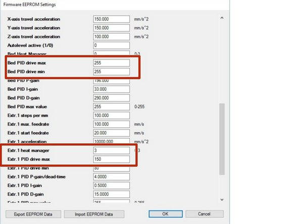

# Heated Bed Installation

Please check this before installing the heated bed:

[05-06-16 Incorrect ground wiring](Incorrect_wiring.md)

Also, please only use shielded wires for the heated bed harness or any wires coming for the heater outputs to avoid EMI.

Tools
 * 2.5mm hex key
 * Soldering Iron
 * Wire stippers
 * Drill
 * Drill bit 1/8" -ish
 * Desire to have fun!

Relevant Parts
 * Reprap heating circuit boardBuy it
 * NTC 3950 ThermistorBuy it
 * Wire 16-18 guage
 * Plug Optional
 * Arduino Mega 2560

## Step 1 — Heated Bed Installation

 * Disconnect the power cable from the machine when doing any modifications to the electronics
 * Locate leads 1 and 3 on your heated board. Solder the positive terminal to 1 and the negative terminal to 3. Do this so the other side of the board remains perfectly flat.
 * Cover the other side with a piece of electrical tape to keep it from shorting against the metal platform. VERY IMPORTANT. If you short these wires against the metal body or platform it will damage the Arduino, it's an easy fix, but nobody likes down time!
 * This wiring setup allows you to only run half of the heated board. Since the board is 8.5" square, and uses more power than necessary (at 19V vs 12V) or than we have available. We're now able to heat a 8.5" x 4.5" area with the correct wattage. The thick aluminum platform will conduct the heat and allow for good thermal distribution.
 * Solder your NTC 3950 thermistor to two long wires. Shown here I used a broken harness so I would be able disconnect the bed when I wanted to mill.

## Step 2

 * Mark a spot on your platform where you would like to take the temperature from.
 * Drill a hole. I drilled mine about 1/2" deep.

## Step 3

 * Trim the top corners of the board. Be careful not to cut into the circuit. You can see where the circuit exists. You'll want these style wire clippers shown here.
 * Clip a V in the bottom center. Be very careful not to clip the circuit.

## Step 4

 * Place a strip of 2" Kapton tape all the way around the perimeter of the platform.
 * Place a strip of 2" Painters tape around the perimeter over the kapton tape.
 * Fold the tape down on both sides of the platform. This works to keep the aluminum from conducting too much heat into the air. It's basically insulation.
 * Lay the heated bed over the center of the underside of the platform so all registration holes in the magnets are free from any coverage.
 * Trace the outline in the tape and trim way anything that would sit between the heated bed and metal platform.

## Step 5

 * User binder clips to secure the heated bed to the UNDERSIDE of the aluminum bed. Making sure you are not covering the magnets.
 * Use heatsink plaster to cover over the thermistor and put some inside the hole you drilled earlier.
 * Install thermistor deep into the hole being careful not to allow a short between the wires and the aluminum
 * Let cure
 * You should drill a hole through the thickness of the platform and run a wire tie through and around the wires to support the wires and keep the thermistor from being able to be pulled out during printing (not shown here)

## Step 6 — Remove back cover

 * Unscrew the cover bolts a few turns, don't remove them. Lift upwards slightly and pull back a little.
 * Disconnect top fan plug if necessary for more available movement.
 * Slide cover to the side carefully

## Step 7

 * Locate the hole that allows the bottom limit switch wires to come through. Feed your heated bed wires through
 * In my case I used a damaged plug given to me by the BoXZY team. I recommend this approach as it will be very simple to remove my heated bed when needed.

## Step 8

 * Locate heated bed input at the bottom of the board. It's the only one without wires installed.
 * Install Positive wire to the far edge and negative wire to the inside. Unscrew the flathead screw and place wire into the slot, tighten down
 * Check that the connection is secure and does not pull out. Verify there are no loose or free wires shorting between the positive and negative terminals.

## Step 9

 * Locate thermistor plug for heated bed. It's the top plug and the only one without a plug installed
 * Install your connector or leads into the plug. The middle pin isn't used. Connect the two wires to the top and bottom pin. Order doesn't matter, there is not positive or negative.
 * You can hijack the second plugs connector if you'd like (the actual wires and plug not the spot on the board). It's for the #2 extruder thermistor which doesn't exist yet.

## Step 10

 * Reinstall your back cover. Place the bottom to the machine first and plug the top fan plug back in that we removed earlier. Visually inspect your heatsinks and make sure they are installed and not hanging off or missing.
 * Use your fingers to push the wires to the sides as you bring the top towards the machine. This will keep them from getting caught between the fans and the heatsinks and blocking airflow.
 * Place the cover holes over the bolt heads and slide down. Careful about the filament drive harness, you must make sure it's in its own groove.
 * Screw down cover.
 * Turn on power to verify there are no wires hitting the fan blades making a scratching noise.

## Step 11

 * Tape the top of the platform with a layer of Kapton tape and then a layer of harbor freight quality painters tape.
 * Zip tie the wires so that they will not get caught between the bottom of the ballnut and the base.

## Step 12

 * The power cable should be disconnected but the USB cable should be installed in the computer and BoXZY for this step.
 * Open the Arduino software and load the firmware file found in "Files" here.
 * Locate and click the Configuration.h tab
 * Click Contrl+F and search for "Have_heated_bed"
 * Adjust the numbers to match what is shown on the third image.
 * Load the edited firmware files to the board. You should see a "done uploading" at the bottom when this is completed correctly. Use the link below for instructions, follow steps 2-3. [Updating Your Firmware](Upgrading_firmware.md)

## Step 13

 * In the interface go to your printer settings. Under the "Extruder" tab enter 120 as your max bed temperature.
 * Go to the config selection at the top of the interface while connected to your machine. Click "Firmware EEPROM configuration". Adjust the "Extr 1 PID Drive Max" to 150. Adjust the "Bed PID Drive Max" and PID Drive Min" to 255.
 * Click OK at the bottom. Close and reload the EERPOM settings to verify it saved.

## Step 14

 * The temperature can be controlled and viewed in the manual control window. You will see a new bar appear.
 * Print away!

# Conclusion

First I want to thank the BoXZY team for letting me prototype and problem solve this setup on one of their testings units. I can't believe how easy it was. It's all there for you; coding, output, inputs, and control.

I highly recommend having a spare Arduino Mega for this installation. Though I did not damage mine, a wiring mistake can easily do so. They are around $20 and are easy to replace.

This system will allow you to get to 100C in about 25 minutes, 35 for 110C and 40 for 115C. It has no problem maintaining it. We are using nearly every ounce of BoXZY's excess power here, so some of the PID max tuning may need to be done for certain situations. However these settings have been 100% reliable for me so far. If you do end up pulling too much power your power supply will shut off (it will not harm it). You must disconnect the plug from the machine and the wall for it to reset. Let me know what you think and feel free to ask questions. I'll continue to improve the manual as times goes on.
