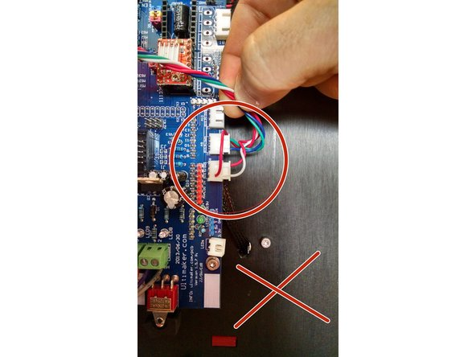
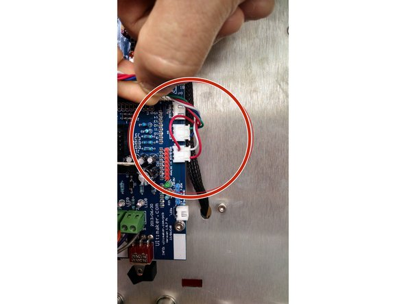
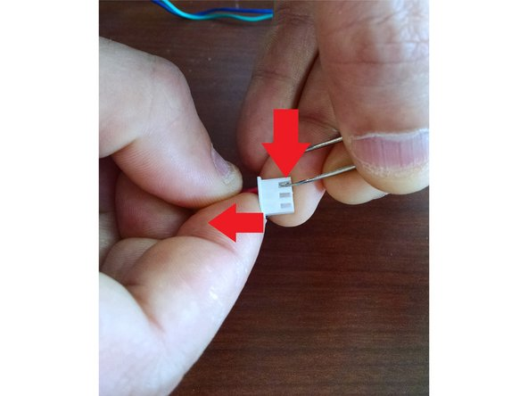
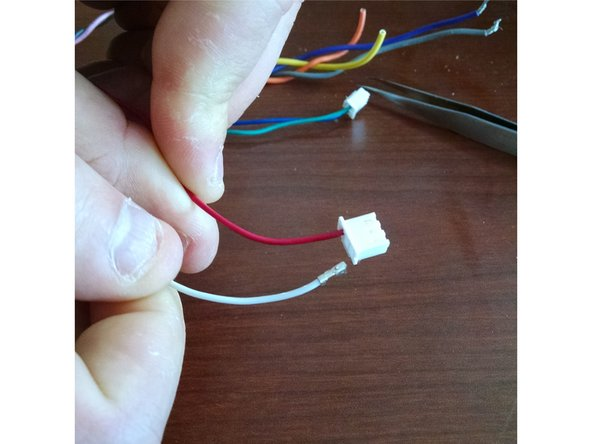

# Incorrect ground wiring

**Many BoXZYs left the factory with the signal and ground wire for the thermistor reversed. It has only caused an issue for small number of BoXZY users, however, it should be corrected if you have the opportunity or before you do any modifications.**

## Step 1 — 05-06-16 Incorrect ground wiring

 * The first pictures with the red X shows the incorrect layout. White wire on bottom, red on top. Independent red wire connected to bottom pin.
 * The second picture show the correct layout. White wire on top, red on bottom. Independent red wire connected to upper pin.

## Step 2 — Fixing Incorrect Wiring

 * To fix, remove the connector and swap the pins by using a paperclip or needle to push down the silver clip in the connector which will allow you to separate the pin from the connector.
 * When removed, the wires should appear as in the second picture.
 * Once swapped, place the red independent wire into the top pin in the same way it was connected in the bottom pin when you removed it.
