# Laser Etching with BoXZY

This manual will guide you through a two-part process. First, you'll check that your laser is functioning properly by engraving a test file using a G-code script. Then, you'll learn BoXZY's laser etching process from start to finish by engraving another test image imported into the BoXZY Laser Tab.

By beginning this manual we assume you have read and understood the following manuals and wiki. If you have not read them, please do so now.
 * [Preparing to use BoXZY](Preparing_to_use_BoXZY.md)
 * [0.1 BoXZY Safe Use](01_Boxzy_safe_use.md)
 * [1.1 Un-Boxing Your BoXZY](11_Un_boxing_your_Bozxy.md)
 * [1.2 Setting Up Your BoXZY](12_setting_up_your_Boxzy.md)
 * [1.3 Using your BoXZY](13_using_your_Boxzy.md)

**READ BEFORE LASERING:**

Always make sure that the inside of BoXZY and the Leveling Platform surface are clean and clear of debris before attempting to use the Laser Head.

We recommend starting out with materials like solid wood, natural leather, or dark colored acrylic for best results.

## Step 1 — Setting Up BoXZY to Test the Laser: Part 1

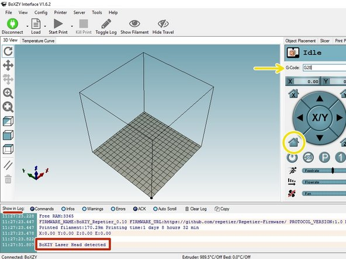
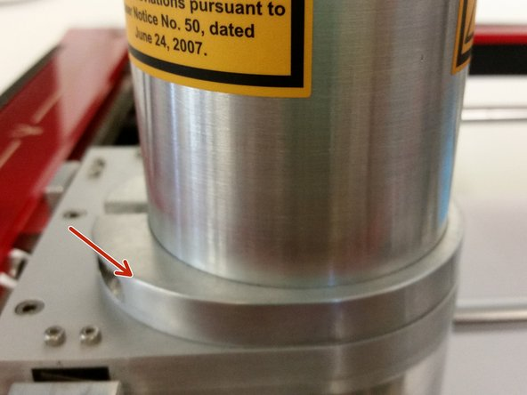

 * First, remove any Attachment Head from the Attachment Mount.
 * Make sure that your Leveling Platform is leveled atop the Milling Platform. If you haven't leveled it yet, follow steps 2 and 3 in our 3D Printing Guide.
 * In the Manual Control Tab, home your X, Y and Z axes. You can do this by clicking the lower left home button or by typing G28 into your G-code input line (shown with yellow indicators in the first image) and clicking Send.
 * Insert the Laser Head into the Attachment Mount. The Head's metal ring should sit flush with the top of the Mount, as shown by the red arrow in image 2. Lock the Head in and connect the quick-change cable to your Laser Head.
   * When plugging your cable in, be sure you have the plugs squarely aligned, as you did with the Attachment Mount and limit switch during your first setup.
   * Be aware of the quick-change head and limit switch cables when using BoXZY. They can easily fall over and catch on one of BoXZY’s corners while in use. To avoid this, you can zip tie them together or 3D print a cable guide for BoXZY by following this link.
 * When you connect the quick-change cable to your Laser Head, you should see "BoXZY Laser Head detected" in the log display in the interface, as shown in the red box in image 1.

## Step 2 — Setting Up BoXZY to Test the Laser: Part 2

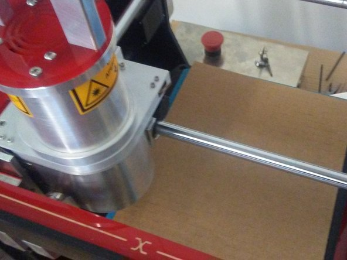

 * Take a piece of double-corrugated cardboard that's about the size of your Leveling Platform and measure its thickness with a metric ruler or caliper. You want your measurement to be in millimeters. Now, center the piece of cardboard on the platform similar to the first image
   * If you have to use thinner cardboard, lower your maximum power level using step 10 so that the laser doesn't cut clean through it.
 * Add your material thickness measurement to 50.7mm. This is the Laser Head's focal distance.
 * In your G-code input line, type G1 Z# and then click Send, where # is the value in millimeters that you just calculated by adding your material thickness to the focal distance. *You will not have to manually calculate and set this value in the future.*

## Step 3 — Setting Up BoXZY to Test the Laser: Part 3

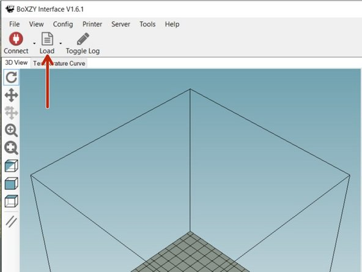
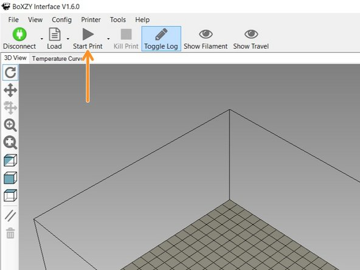
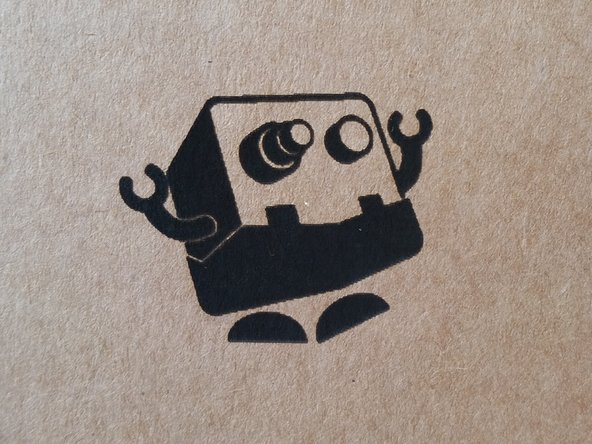

 * The BoXZY Laser Test file is a G-code script. Usually, your process for laser etching will be to open an image file in the BoXZY Laser Tab, NOT to use the Load button in the main interface window to load G-code. We're using G-code now to test the Laser Head itself. Later, we'll dive into working with images.
 * Go to this link and download the BoXZY Laser Test file.
 * In the BoXZY Interface, select the Load button and locate the BoXZY Laser Test file you downloaded.
   * Put your Laser Safety Glasses on and make sure that anyone in viewing distance of the laser is wearing Laser Safety Glasses.
 * Click Start Print and watch BoXZY perform the Laser Test.
 * After the BoXZY Laser Test G-code is done running, the Laser Head will turn itself off. Press the physical e-stop on the Power Station and examine your etching (remember to twist and release the e-stop before attempting to resume using BoXZY)
   * You should see the BoXZY robot icon etched into the cardboard. If it resembles the third image, your Laser Head is working well. You can use a clean, dry microfiber cloth to clean off any carbon residue from the etching. Any oils or moisture will smear the black carbon and make it very difficult to remove.
 * Next, we'll learn how to use the BoXZY Laser Tab to adjust and fine-tune image files for etching or cutting.

## Step 4 — Using the BoXZY Laser Tab

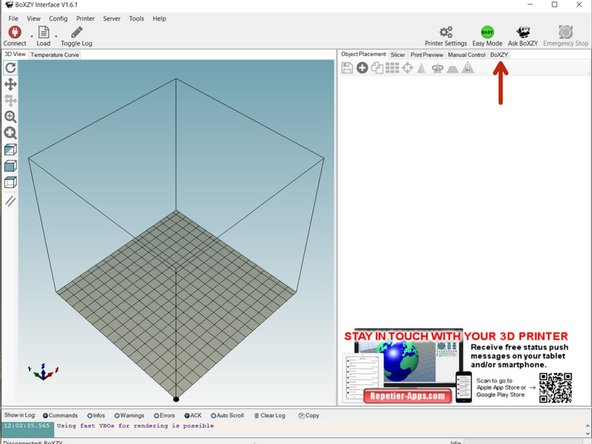
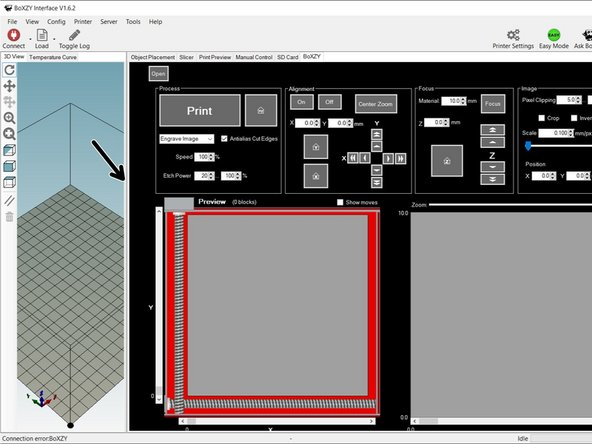
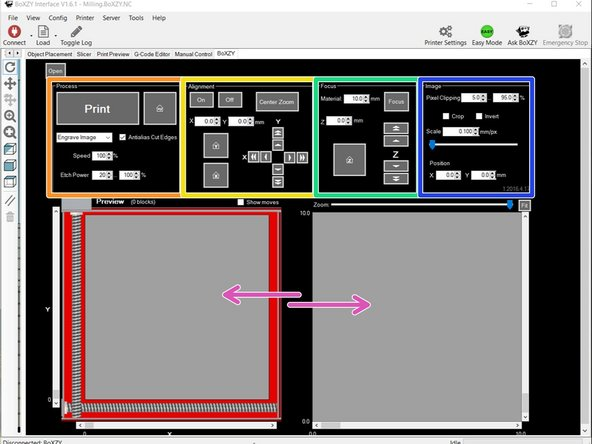

 * In the BoXZY Interface, select the BoXZY Tab, indicated by the red arrow in the first image. BoXZY's Laser Tab can accept .png, .jpg, .bmp, .gif, and .tif files. Please read through the entire guide before trying your own file.
   * You may have to adjust your window size to see the entire BoXZY Laser Tab. Do this by selecting and dragging the Window Separator, indicated by the black arrow in the second image.
 * There are four Control Panels in your BoXZY Laser Tab. You can see them in the third image. The colored boxes correspond with the panel names below:
   * Process
   * Alignment
   * Focus
   * Image
 * The BoXZY Laser Tab has two preview windows, indicated by the pink arrows in the third image. On the left is the Main Preview Window and on the right is the Zoom Preview Window. We'll discuss the control panels and preview windows in more depth in the next steps.

## Step 5 — Preview Windows

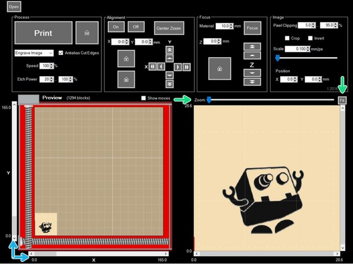

 * The left window is the Main Preview Window. It shows you where your image is located in BoXZY, and it shows the image's size relative to the Leveling Platform.
 * You can adjust the location in which your image will be etched by using the sliders, indicated by blue arrows, to move the image. Each slider will move it in one axis/direction
 * The right window is the Zoom Preview Window. It shows your image and the adjustments you make to it using the Image Panel.
 * Above this window, you'll find a Zoom slider that lets you zoom in closer on your image preview (this doesn't affect the size or scale of the etching) and a Fit button that will fit the view of the image to the window size. Both of these are indicated by the green arrows in the image.

## Step 6 — The Focus Panel

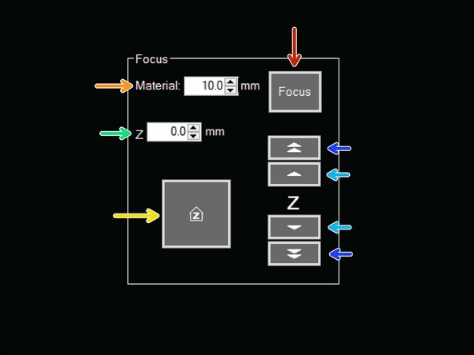

 * The Focus button (shown by the red arrow) will send the Z axis to the position of the laser's focal distance, 50.7mm.
 * The Material box (shown by the orange arrow) is where you enter the thickness of the material you're lasering.
 * The Z box (shown by the green arrow) shows the value you get when you add the material thickness to the laser's focal distance.
 * The Arrows in the Z box will adjust the laser focus by 0.1mm up or down. These arrows will allow you to adjust the Laser focus and fine-tune the quality of your etching or cut.
 * The Z button will send the Milling Platform and Leveling Platform to the Z axis home. Do not use this button when there is material in your BoXZY or an Attachment Head in the Mount.
 * The Single Arrow Z Button (shown by the light blue arrow) will move the Z axis up or down 1mm.
 * The Double Arrow Z Button (shown by the dark blue arrow) will move the Z axis up or down 10mm.

## Step 7 — The Alignment Panel

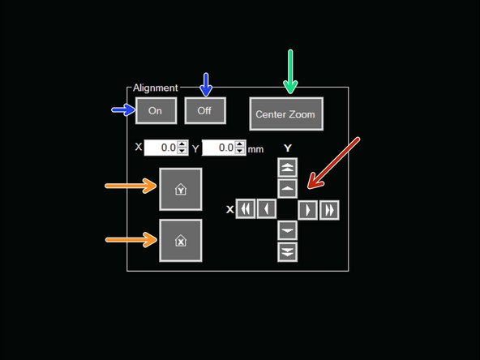

 * Just like in the Manual Control Tab, you can move the X and Y axes incrementally using the directional pad, as indicated by the red arrow in the image.
 * The orange arrows indicate the Send X to Home and Send Y to Home buttons. They act the same as they do in the Manual Control Tab.
 * The On and Off buttons, shown by blue arrows, toggle Alignment Mode. When Alignment Mode is on, the laser turns on at a very low power level. This projects a blue dot onto your material, showing you the exact location of the Laser Head.
 * The Center Zoom button (shown by the green arrow) will center the Zoom Preview Window to the X, Y coordinates where your Laser Head is currently located. This will show the part of your image file that is directly below the Laser Head.

## Step 8 — Alignment Panel Test: Part 1

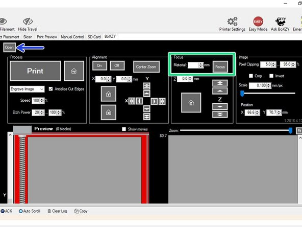
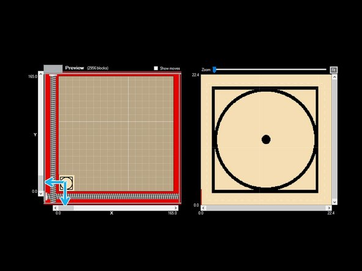

 * Before running the Alignment Panel Test, return to Step 1 and follow the first 4 bullet points to home your axes and install the Laser Head.
 * Go to this link and download the Square Circle image that we have prepared.
 * Take a piece of cardboard that's about the size of your Leveling Platform and center it on the platform. Measure the cardboard's thickness in millimeters and enter this value into the Material box, shown by the green box in the first image. Then, click the Focus button to send the Leveling Platform to the correct focal distance.
 * To load a file into the Laser Tab, select the Open button in the upper left hand corner of your screen, as shown by the blue arrow in the first image. This is the only button you can use to load actual image files.
   * The laser interface automatically produces a gcode script based on current settings when you load an image, and a new script after adjusting any settings. It is automatically loaded into the gcode editor for you to view, edit, save, or run
 * Once the file is opened, use the X and Y sliders (shown by blue arrows in the second and third images) in the Main Preview Window to move the image around. For the test, move the image to the center of the window.
 * In the Alignment Panel, toggle Alignment Mode on. The laser will turn on at the lowest power setting and you'll see a blue dot appear on your material. Note its location.
   * Wear your Laser Safety Glasses when the laser is on, even at low power. Do not place your hands in your BoXZY when the laser is on at any power level.

## Step 9 — Alignment Panel Test: Part 2

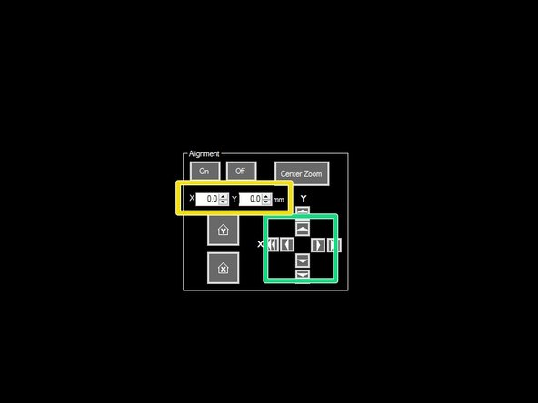
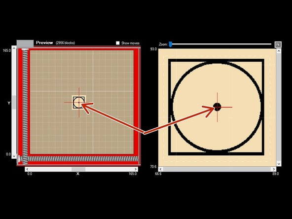
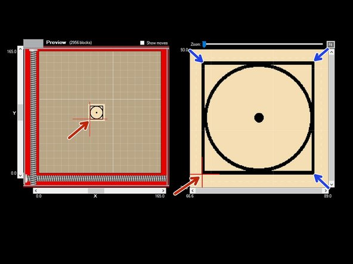

 * Use the directional pad on the Alignment Panel (green box in image 1) to move the red crosshairs to the dot in the middle of the circle, as shown in image 2. The red crosshairs show the Laser Head's physical location relative to where it'll be when etching that exact part of your image.
   * You can also use the X and Y boxes, shown in the yellow box in image 1, to more finely move the red crosshairs/Laser Head.
   * If you need to, move your material so that the blue dot lines up exactly with its center. This is how you physically align your material.
 * Using the X and Y directional pad, move the red crosshairs around to each corner of the square, as shown in image 3.
   * At each corner, look at the blue dot inside of BoXZY. This is where each corner of the square will be etched onto your material.
 * In the Process Panel, click the Print button to begin the Square Circle image and watch BoXZY perform the Alignment Panel Test. After the test is finished, press your physical e-stop (remember to twist and release the e-stop before attempting to resume using BoXZY) and examine your Alignment Panel Test
   * Keep your Laser Safety Glasses on and make sure that anyone in viewing distance of the laser is wearing Laser Safety Glasses.

## Step 10 — The Process Panel

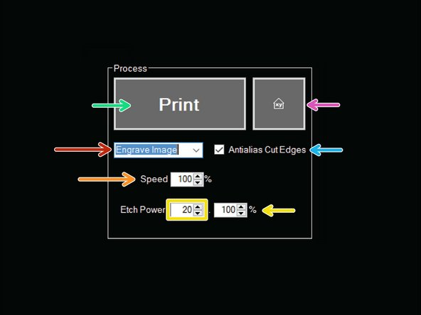

 * You have the options to Engrave an image, Cut Outline an image or Both using the dropdown box in the Process Panel. This is shown by the red arrow in the image.
 * You can adjust the Speed as a percentage of the maximum speed that BoXZY will allow, indicated by the orange arrow.
 * You can use the Etch Power boxes (shown in yellow) to adjust the laser’s min and max power output. This restricts the range of shades that appear in the etching. You always want to set your max power to the lowest possible percentage that gives you the darkest, deepest etch. Usually your material determines what that lowest possible value is.
   * The first value, shown in the yellow box, sets the lowest power the laser will use. This should match the lowest power that will start to mark the material. If = 20, the laser will run at 20% power for the first shade gradient darker than the lightest shade in the image
   * The second value, shown by the yellow arrow, sets the max power. If this = 100, then the laser will engrave the darkest parts of your image at 100% power. If it’s at 80%, then the laser will only engrave the darkest parts of your image at 80% power. Keep in mind that setting max power too high can hurt gradient definition, explained Here
 * When the Antialiasing Cut Edges box is checked, the edges of your image will be smoothed out and less pixelated when the laser performs a cut path.
 * The pink arrow indicates the Home X and Y button. Be careful using this button with your Laser Head inserted into your Attachment Mount when there is material on your Leveling Platform.
 * Begin your etch by selecting the Print button. Be sure that you and anyone around you are wearing Laser Safety Glasses while the laser is on.

## Step 11 — The Image Panel

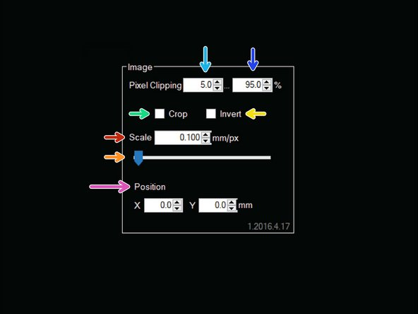

 * Control image lightness and darkness with Pixel Clipping. Pixel Clipping treats all pixels along a shade gradient of lightest to darkest. Use these settings to control what pixels are engraved at the highest power setting to render the darkest shade and where to render the lightest shade with laser power off.
   * Darken your image: A higher percentage in the box indicated by the light blue arrow will create darker tones in your image. If you set this value to 20, it means that pixels that are darker than 80% of the pixels in the image will engrave at the maximum laser power and render as black.
   * Lighten your image: A lower percentage in the box indicated by the dark blue arrow means that more of the image renders as pure white. If you set this value to 80, the lightest 20% of pixels will render as pure white.
      * This setting is especially helpful if you're using an image on a white background that contains some undesired, stray off-white pixels. Since the Laser Head skips over the range of pixels you tell to it treat as pure white, adjusting this setting can help you speed up your etching time.
      * If you load an image after adjusting the value in the left box to be greater than in the right box, the interface will freeze and you'll have to restart it. The first box should always be a lower value than the second
 * Scale your image up. You can make your image bigger by moving the slider, shown with an orange arrow, to the right. Or you can manually enter a value into the Scale box, as shown by the red arrow. This scales the image up relative to your given number of millimeters per pixel. Scaling up is limited by the size of your image file.
 * To invert your image's colors, select the Invert box indicated by the yellow arrow to check it. When the Crop box indicated by the green arrow is checked, it will crop out the image's background.
 * You can adjust your image's position along the X and Y axis with the X and Y positioning boxes.

## Step 12 — Preparing an Image File for BoXZY

 * Note: The Laser Tab isn't an image editor. Use the image editor of your choice to scale and size images before loading into BoXZY. To avoid longer etching times and stray pixels, we highly recommend using high quality .png files with completely transparent backgrounds.
 * Scaling your image. When preparing an image to etch, you want to scale your image relative to BoXZY's native resolution: 254 pixels per inch (ppi). You can set image resolution in your image editor.
 * Sizing your image. When sizing your image file, remember that 1 pixel = 0.1mm to BoXZY. For example, if you want your etch to be 20mm wide, you'll need to create an image file that is 200 pixels wide.
 * Take note of BoXZY's orientation shown in the left preview window (shown on the left side of the first image):
   * The blue arrow in the left preview window points to the pulley cover for the Y axis.
   * The orange arrow points to the X, Y home axes. This is where all images will be first placed when you load them.
   * The green circle indicates a red crosshairs, which shows where the Laser Head is physically centered over.
   * You may have to modify your image orientation depending on how you place your material within BoXZY.

## Step 13 — Loading an Image

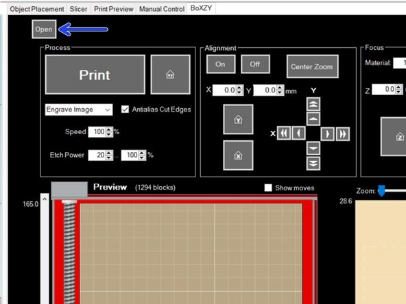

 * To load a file to the Laser Tab select the Open button in the upper left hand corner of the screen, as shown by the blue arrow in the image.
   * Remember: You can only load image files using the BoXZY Tab. You cannot use the same Load button that you use to load milling or 3D printing files.
 * Locate the image file you want to Laser etch or cut. Remember: The Laser Tab can accept .png, .jpg, .bmp, .gif, and .tif files.
 * Remember to move the image around the Main Preview Window to where you want your material to sit on the Leveling Platform. Click the On button in the Alignment Panel to activate Alignment Mode. Then use the red crosshairs to precisely locate where the laser will etch the image onto your material.
 * The BoXZY Interface will automatically convert colored images to grayscale. Images intended for cutting should only be in black and white, or the cut outline function will not work properly. If you'd like to use vector files to experiment further with cutting, you can use a BoXZY user-designed plugin for Inkscape.
   * This guide has instructions for installing the Inkscape plugin on a Mac, but you can use it on Windows too. Just download the Windows version of Inkscape.
 * Before you use your Laser Head on a new material, do your research on the danger of its fumes. Avoid chemically treated and non-natural materials. Use fan ventilation when necessary and never attempt to etch onto a material that releases hazardous fumes, is mirrored, or is highly reflective

## Step 14 — Laser Time!

 * Now you are ready to play with your BoXZY Laser!
 * It's best to see what results the stock settings give you before adjusting the settings to your material and image
 * Feel free to use your BoXZY Laser Head now or to follow another Attachment Head guide.
   * [3D Printing Guide](3D_printing_guide.md)
   * [CNC Milling with BoXZY](CNC_milling_with_Boxzy.md)
