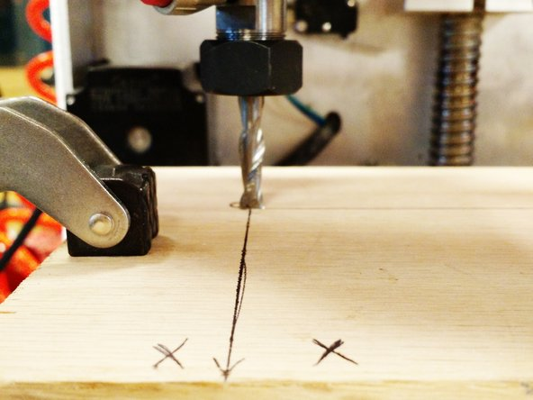
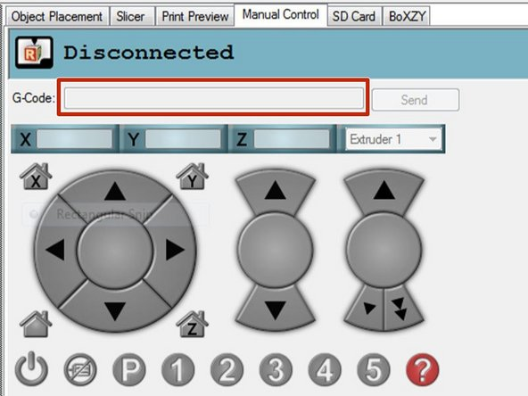
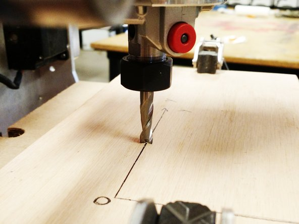
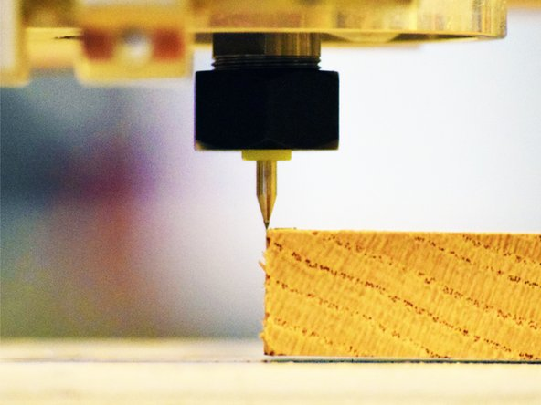
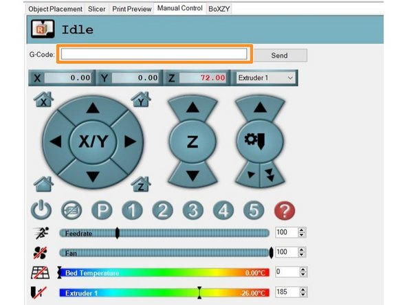
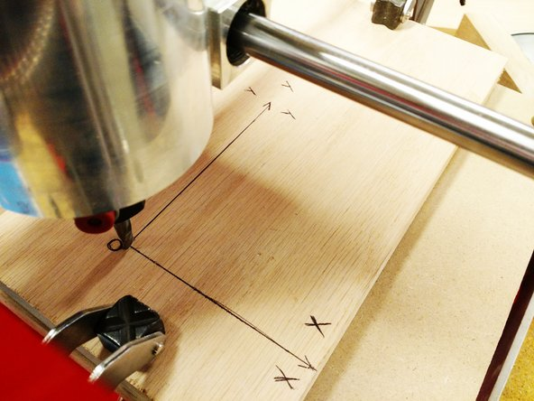
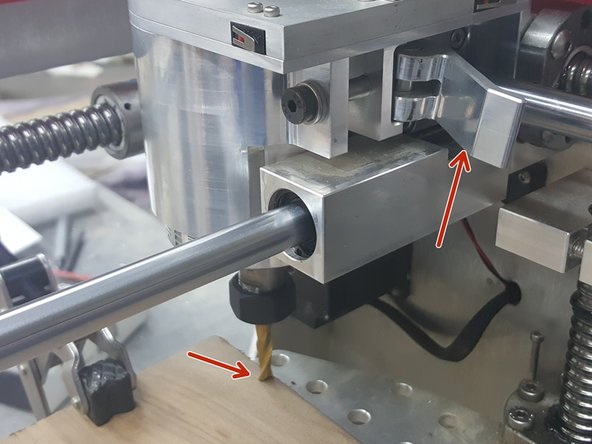
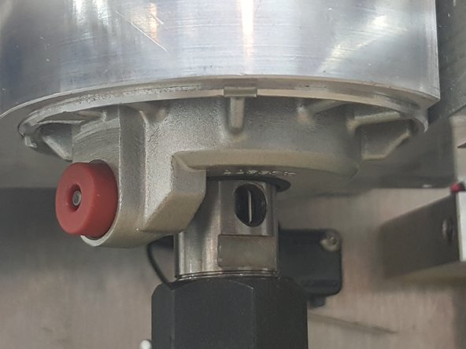
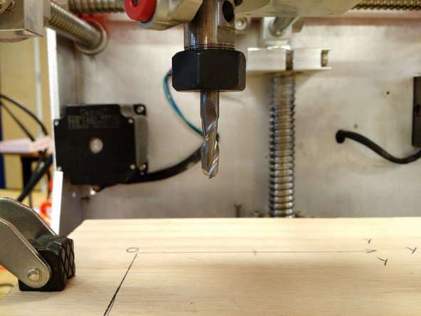
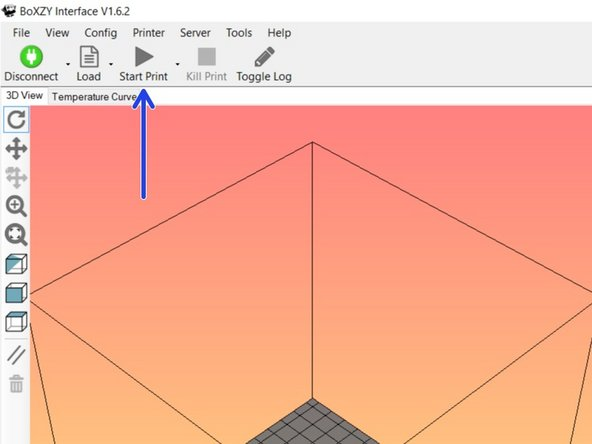

# Setting User Home for Milling

This is a mini-manual that expands on topics introduced in [CNC Milling with BoXZY](CNC_milling_with_Boxzy.md).

By beginning this manual we assume you have read and understood the following manuals and wiki. If you have not read them, please do so now.
 * [Preparing to use BoXZY](Preparing_to_use_BoXZY.md)
 * [0.1 BoXZY Safe Use](01_Boxzy_safe_use.md)
 * [1.1 Un-Boxing Your BoXZY](11_Un_boxing_your_Bozxy.md)
 * [1.2 Setting Up Your BoXZY](12_setting_up_your_Boxzy.md)
 * [1.3 Using your BoXZY](13_using_your_Boxzy.md)

## Step 1 — Machine Home vs. User Home

 * Machine Home is the the position the axes go to when using the BoXZY Interface home buttons, or when the G28 G-code command is used.
   * Machine Home uses the minimum limit switches to determine when X, Y, and Z are in the home position.
 * User Home is any X, Y, Z position that the user defines as 0 that is not the Machine Home.
 * You define the User Home using a G92 command followed by the axis designation (X, Y, Z) and "0". Ex: G92 Z0.
   * Using G28 or a home button after defining User Home with G92 will undo your User Home. If this happens, you'll need to reset your User Home with G92.
   * You will always follow step 4 in this manual to set a User Home for the Z axis before every milling operation, even if you are not creating a User Home for the X and Y axes. This is to account for your material's height on the Milling Platform and the length of the bit.
   * Why would I define a User Home for my X and Y axis? Here is one reason.

## Step 2 — Setting the X Axis User Home Position

 * Find the drawn line, edge, or other position that you wish to be your X0 (as shown in the first image) and align the center of your bit to it using manual controls. Make sure your milling bit is slightly above your material, not touching it.
   * An easy alignment method is to use a thin bit with a sharp point to find the edge first, as shown in the second image. Set your 0 with the thin, pointed bit and then swap your work bit back into the attachment.
 * Type G92 X0 into your G-code input line, shown in the red box in the third image, and select Send. This sets your current position as 0.
   * Type G1 X0 into your G-code input line and select Send to verify your 0 position for the X axis.
   * Your head should not move when you perform the G1 X0 command, because you just set that position as 0. If it does, move back to your desired user home position and perform the G92 command again.
   * It is extremely important to verify the 0 position was set properly to avoid crashes during milling.

## Step 3 — Setting the Y Axis User Home Position

 * Repeat the process in the previous step to align the center of your bit to your desired Y0 posiion.
 * Type G92 Y0 into your G-code input line, shown in the orange box in the third image, and select Send.
   * Type G1 Y0 into your G-code input line and select Send to verify your 0 position for the Y axis.

## Step 4 — Setting the Z Axis User Home

 * Setting the Z axis User Home or Z Start Point (also, sometimes called Z Height) is an extremely important step that must be completed every time you mill. While you may choose to mill from the Machine Home on the X and Y axis, it's impossible to mill from the Machine Home on the Z axis.
   * Setting the Z User Home tells BoXZY where the bottom of the bit is and where the material starts. BoXZY does not know this until you manually define this point by setting the Z User Home.
 * With your milling bit directly over the X0 and Y0 User or Machine Home positions (shown in the first image) unlock your Milling Head and gently slide it down until the bit is resting directly on the material, as shown by red arrows in the second image. Do not clamp it in place just yet.
   * You may need to move your milling platform up or down so the milling bit can rest on the surface of the material.
   * With the Attachment Mount clamp still unlocked, fine tune the position of the Z plate until the bit is resting on the surface of the material and the base of the Makita body is nearly flush with the base of the Attachment Mount, as shown in the third image.
 * Type G92 Z0 into your G-code input line and select Send.
   * Test that it is set correctly by entering G1 Z0 into your G-code input line. If your Z User Home is set correctly, the Milling Head shouldn't move.
   * Lock your Milling Head firmly into the Attachment Mount and check that it is tight, you do not want your Milling Head to come loose while milling your file.

## Step 5 — Always Run an Air Pass

 * An air pass is a way to check that your milling file behaves the way you intended by executing the file in air before cutting into your material. It is extremely important that you always perform an air pass before milling actual material.
   * Performing an air pass before milling actual material will help you prevent problems like cutting your clamps, cutting material in the wrong location, and moving too fast or too slow.
 * To safely run an air pass, you follow all the steps you'd normally follow to mill a file, but you intentionally set your Z User Home too high. We also show you another way to run an air pass without resetting your Z User Home in our CNC Milling manual.
   * With either method, make sure that the space you leave between your bit and the milling material is greater than the deepest cut your file will make.
 * When running an air pass, keep the e-stop near you and pay close attention. Even the best machinists perform air passes with their hand on the e-stop.
 * After running an air pass, always remember to reset the Z User Home back to your material surface before executing your file.
 * BoXZY must be at 0, 0, 0 before starting your file. If you move any axis for any reason after setting your User Home, use G1 X0 Y0 Z0 to return to it.

## Step 6 — Return to the Milling Manual

 * Return to [CNC Milling with BoXZY](CNC_milling_with_Boxzy.md).
